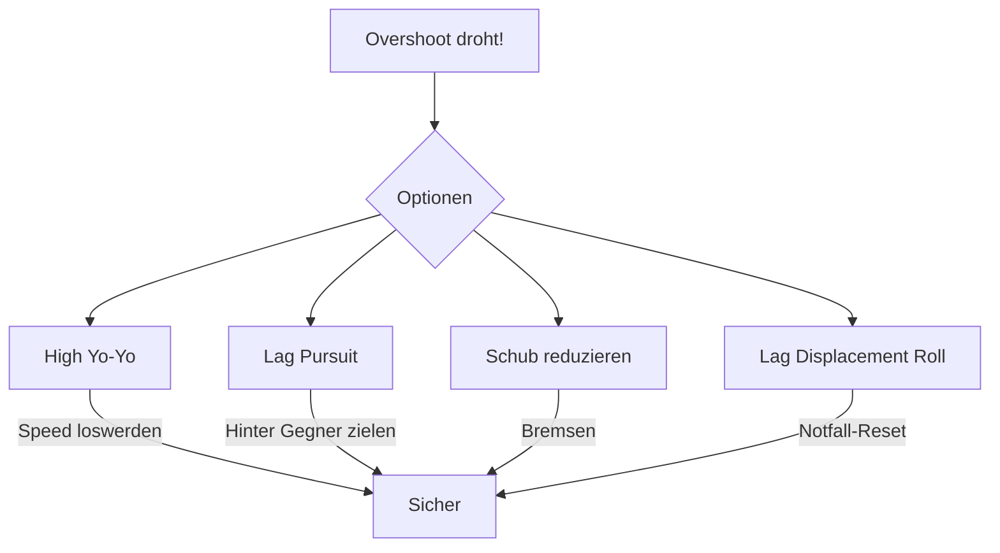

# Lag Displacement Roll

Ein Manöver gegen extremen Geschwindigkeitsüberschuss oder um eine Schussposition zu erzwingen, wenn der High Yo-Yo nicht ausreicht.

## Ausführung

1. Wechsle zu **Lag Pursuit** (hinter den Gegner zielen)
2. Rolle **weg** von der Kurvenrichtung des Gegners und ziehe hoch
3. Nutze die **Vertikale** um massiv Vektorgeschwindigkeit zu vernichten
4. Falle hinter den Gegner zurück

## Overshoot verhindern

Overshoot ist der häufigste Fehler. So vermeidest du ihn:

### Erkenne die Warnsignale

| Warnsignal | Bedeutung |
|------------|-----------|
| Sehr hohe Closure Rate | Du näherst dich zu schnell |
| Gegner wird größer im HUD | Annäherung zu aggressiv |
| Gegner beginnt Break Turn | Er will dich overshooten lassen |

### Gegen-Maßnahmen

::: tip ANWENDUNG
Ideal, um einen drohenden Overshoot in eine offensive Position umzuwandeln, ohne Energie sinnlos wegzuwerfen. Besonders effektiv für Flugzeuge mit gutem Schub-Gewichts-Verhältnis.
:::
