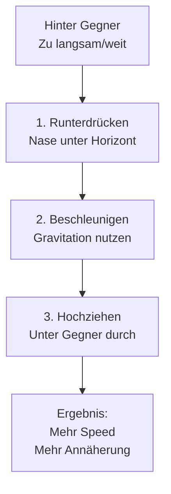

# Low Yo-Yo

Das Gegenteil des High Yo-Yo. Nutze es, wenn du zu langsam bist oder der Gegner entkommt.

## Wann nutzen?

- Gegner gewinnt Separation
- Du bist zu langsam
- Du brauchst mehr Annäherung

## Ausführung

**Schritt für Schritt:**

1. **Runterdrücken** - Drücke Nase 20-30° unter Horizont
2. **Beschleunigen** - Lass Gravitation Speed aufbauen
3. **Hochziehen** - Ziehe unter dem Gegner durch, zurück auf seine Höhe
4. **Ergebnis** - Mehr Speed und näher am Gegner

::: warning VORSICHT
Low Yo-Yo bringt dich näher - aber mit mehr Speed. Overshoot-Gefahr steigt!
:::
