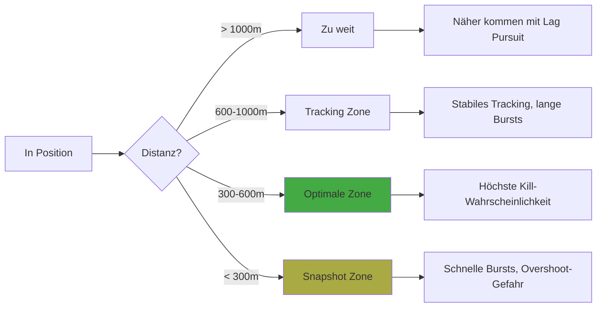
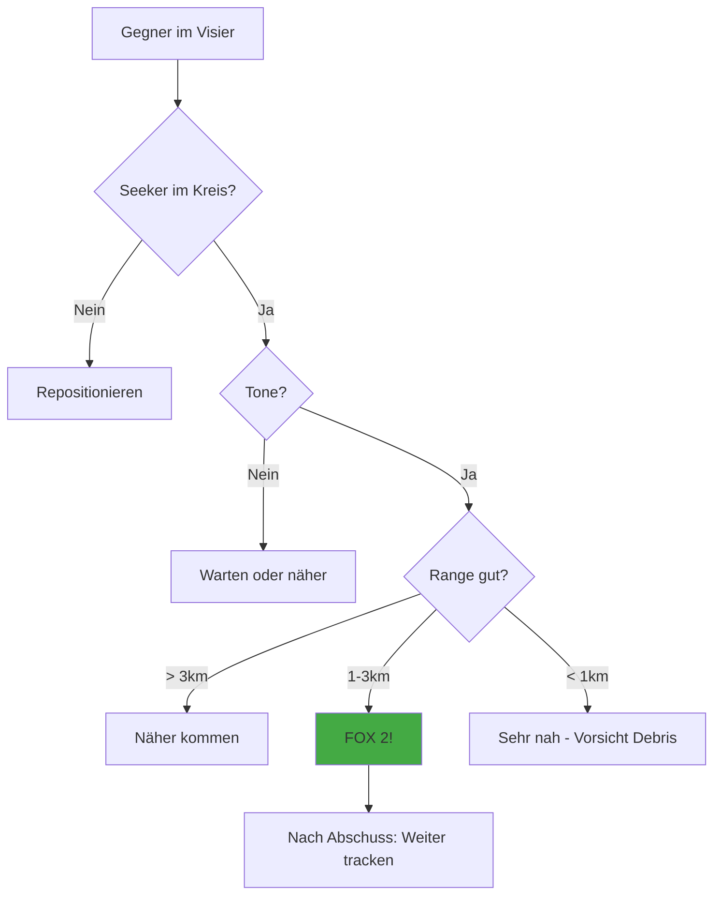

# Schusslösung (Gun & Missile)

> Du bist hinter dem Gegner - jetzt musst du treffen.

Die beste Position ist wertlos, wenn du nicht triffst. Diese Seite erklärt, wie du aus deinem Vorteil einen Kill machst.

---

## Übersicht: Waffen im Luftkampf

| Waffe | Reichweite | Vorteile | Nachteile |
|-------|------------|----------|-----------|
| **Gun** | 200-1000m | Keine Countermeasures, unbegrenzt | Schwer zu treffen |
| **Fox-2 (IR)** | 1-3 km | "Fire and Forget", einfach | Flares als Countermeasure |
| **Fox-3 (Radar)** | 3-20+ km | Lange Reichweite | Chaff, Notching möglich |

---

## Gun Employment

### Reichweiten-Zonen

### Die drei Schuss-Typen

**1. Tracking Shot (600-1000m)**
- Stabiles Verfolgen des Ziels
- Pipper auf dem Ziel halten
- Längere Bursts (1-2 Sekunden)
- Für: Stabile Verfolgung, wenig Relativbewegung

**2. Snapshot (300-600m, schnelle Winkeländerung)**
- Kurze, präzise Bursts (0.5 Sekunden)
- Pipper "durchziehen" durch das Ziel
- Für: Schnelle Gelegenheiten, Übergänge

**3. Close-Range Burst (< 300m)**
- Sehr kurze Bursts
- Maximale Overshoot-Gefahr
- Für: Verzweifelte Lagen, sichere Kills

### Lead Computing verstehen

Der Pipper im HUD zeigt dir, wohin deine Geschosse fliegen werden. Aber:

1. **Der Pipper reagiert verzögert** - Er braucht Zeit, um sich zu stabilisieren
2. **Bewegung = Fehler** - Bei schneller Relativbewegung ist der Pipper ungenau
3. **Entfernung zählt** - Je weiter weg, desto mehr Lead brauchst du

::: tip PIPPER-REGEL
Wenn der Pipper wild springt, ist es KEIN guter Zeitpunkt zu schießen. Warte auf Stabilität.
:::

### Gun-Kill Checkliste

Vor jedem Schuss:

- [ ] Distanz unter 800m?
- [ ] Pipper stabil auf/nahe am Ziel?
- [ ] Relativbewegung gering?
- [ ] Aspect Angle unter 45°?
- [ ] Genug Munition für mehrere Versuche?

---

## Fox-2 (IR-Rakete)

### Funktionsweise

IR-Raketen suchen nach Wärmequellen. Im Luftkampf bedeutet das:

- **Triebwerksabgase** - Primärziel
- **Aufgeheizte Flugzeugteile** - Sekundär
- **Sonne/Flares** - Ablenkung möglich!

### Einsatzprofil

### Optimale Schussparameter

| Parameter | Optimal | Akzeptabel | Schlecht |
|-----------|---------|------------|----------|
| **Reichweite** | 1.5-2.5 km | 1-3 km | > 3 km oder < 0.5 km |
| **Aspect Angle** | < 30° (von hinten) | < 60° | > 60° (von der Seite) |
| **Höhenunterschied** | Gleiche Höhe | +/- 1000 ft | > 2000 ft |
| **Gegner-Speed** | Schnell (heiß) | Mittel | Langsam (kühl) |

### Countermeasures: Flares

Gegner können Flares (Hitzefackeln) werfen, die deine Rakete ablenken.

**Wie Flares funktionieren:**
1. Flare ist heißer als das Flugzeug
2. Raketen-Seeker lockt auf Flare
3. Rakete fliegt am Ziel vorbei

**Gegenmaßnahmen:**
- Schieße aus kurzer Distanz (weniger Reaktionszeit)
- Schieße wenn Gegner dreht (Flares werden nach hinten geworfen)
- Mehrere Raketen in Serie
- Warte bis Gegner Flares verbraucht hat

::: warning FLARE-RESISTENZ
Moderne Seeker sind besser im Unterscheiden von Flares und echten Zielen. Trotzdem: Ein guter Schuss ist besser als viele schlechte.
:::

---

## Fox-3 (Radar-Rakete)

### Kurz-Übersicht

Fox-3 Raketen haben ihr eigenes Radar und sind "Fire and Forget".

| Phase | Beschreibung |
|-------|--------------|
| **Launch** | Rakete startet, fliegt auf Zielkoordinaten |
| **Midcourse** | Rakete folgt Updates von deinem Radar |
| **Terminal** | Eigenes Radar aktiviert, selbständige Suche |

### Wann Fox-3?

- **BVR (Beyond Visual Range)** - Lange Distanz
- **Head-On Engagement** - Frontal-Begegnungen
- **Hit and Run** - Schnelle Angriffe ohne Dogfight

::: info VFM-KONTEXT
In VFM ist der Fokus auf WVR (Within Visual Range) Kampf. Fox-3 spielt eine untergeordnete Rolle.
:::

---

## Taktische Empfehlungen

### Gun vs Missile - Wann was?

| Situation | Empfehlung |
|-----------|------------|
| Stabile Position, unter 800m | **Gun** - Sicher und effektiv |
| Stabile Position, 1-2 km | **Fox-2** - Höhere Trefferchance |
| Gegner manövriert stark | **Gun** - Raketen sind ungenau |
| Gegner flieht geradeaus | **Fox-2** - Perfektes IR-Profil |
| Munition/Raketen fast leer | Konservativ schießen! |

### Die goldene Regel

::: tip GEDULD GEWINNT
Ein sicherer Treffer ist besser als drei verpasste Bursts.

- Warte auf gute Parameter
- Nimm dir Zeit für die Schusslösung
- Hektisches Feuern verschwendet Munition und gibt dem Gegner Zeit
:::

### Nach dem Schuss

1. **Nicht sofort abdrehen** - Beobachte das Ergebnis
2. **Bei Gun:** Korrigiere und schieße erneut
3. **Bei Fox-2:** Halte Ziel im Visier für 2-3 Sekunden
4. **Damage Assessment** - Hat er Rauch? Flammen? Verändert er das Flugverhalten?
5. **Prepare for Merge** - Wenn er noch fliegt, bereite dich auf Gegenangriff vor

---

## Zusammenfassung

| Regel | Beschreibung |
|-------|--------------|
| **Gun Range** | Unter 800m optimal, nie über 1000m |
| **Fox-2 Range** | 1-2.5 km, von hinten |
| **Pipper Stabilität** | Warte bis der Pipper ruhig ist |
| **Geduld** | Qualität vor Quantität |
