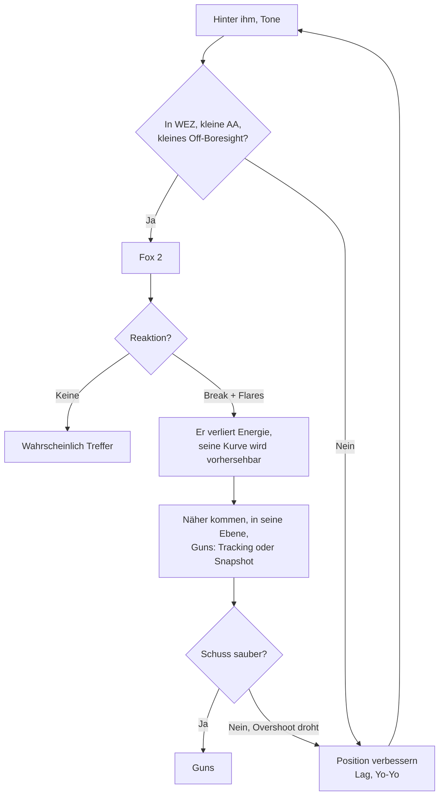

# Schusslösung: Guns und Fox 2

> Position ist nur die Vorarbeit. Hier geht es darum, wann und wie du triffst.

VFM hat zwei Waffen: die **Bordkanone** (Guns) und **einen Typ IR-Rakete** (Brevity beim Abschuss: **Fox 2**). Keine Radar-Raketen, kein Chaff. Was erlaubt ist, legt der Host fest. Bedienung und Anzeigen: [Waffen](/avionik/waffen) und [HUD](/avionik/hud).

## Grundregel: in seiner Ebene

Der einfachste Schuss entsteht, wenn du **in seiner [Bewegungsebene](/grundlagen/geometrie#bewegungsebene-plane-of-motion)** fliegst: Dein Lift Vector liegt auf ihm, deine Kurve in derselben Ebene wie seine. Dann bewegt er sich relativ zu dir nur entlang deiner Nase, nicht seitlich, und du musst nur noch den richtigen Vorhalt ziehen. Außerhalb seiner Ebene korrigierst du in zwei Richtungen gleichzeitig, und die Geschosse laufen seitlich vorbei.

## Guns

### Das Visier: Funnel

Alle drei Jets haben ein EEGS-artiges Kanonenvisier, den **Funnel**: zwei Linien, die zeigen, wo dein Geschossstrom liegt, wenn du deine Kurve beibehältst. Wo der Funnel so breit ist wie die Spannweite des Gegners, stimmt die Entfernung. Mit Radar-Lock kennt das Visier die Entfernung; ohne Lock rechnet es mit einer durchschnittlichen Spannweite, also nur näherungsweise. Das **Gun-Boresight-Kreuz** zeigt, wohin die Kanone ohne Vorhalt zeigt. Die Academy hat ein Gunsight-Tutorial.

### Tracking Shot und Snapshot

| | Tracking Shot | Snapshot |
|---|---|---|
| Wann | Hinter ihm, in seiner Ebene, kleine AA, du gehst seine Kurve mit | Hohe AA bzw. Sichtlinienrate, du kannst den Funnel nicht auf ihm halten |
| Wie | Funnel auf ihn, Flächen füllen den Funnel, kurze Stöße, nachkorrigieren | Funnel in seiner Ebene vor ihn legen, kurz **bevor** er hineinfliegt feuern |
| Erkennen | Funnel **bleibt** auf ihm | Funnel läuft **durch** ihn |
| Preis | – | Geringere Trefferchance; der Lead treibt dich Richtung [Overshoot](/grundlagen/offensiv/overshoot) |

Der Schusstyp hängt vom **Winkel und der Relativbewegung** ab, nicht von der Entfernung. Ein Snapshot ist eine Gelegenheit, keine Taktik.

### Reichweite und Munition

- Je weiter weg er ist, desto länger fliegen die Geschosse und desto mehr Vorhalt brauchst du. Richtwert aus dem realen BFM: erst unter etwa 3.000 ft wirklich aussichtsreich, besser näher. VFM nennt keine offizielle Reichweite.
- **Kurze Stöße.** Munition ist endlich, es gibt kein Nachladen, und mit leeren Stores startet ein Selbstzerstörungs-Countdown.

### Head-on Guns

Frontalschüsse im Merge können in Custom-Lobbys erlaubt oder verboten sein; dazu kommt die Einstellung **Merge Safety** (standardmäßig an). Prüf vor dem Match, was gilt. Wenn erlaubt: Ein Frontalschuss ist ein Snapshot mit sehr hoher Closure – kurzer Stoß, dann aus seiner Schusslinie. Kommt er dir schussbereit entgegen, versetz dich vor dem Merge aus seiner Ebene. Siehe [Der Merge](/grundlagen/neutral/der-merge).

## Fox 2 (IR-Rakete)

**Tone:** Der Suchkopf muss das Ziel erfassen, bevor du schießt; üblich ist ein Ton, der bei Aufschaltung lauter bzw. höher wird. Kein Tone, kein Schuss.

**WEZ der Rakete** ([Gun vs. Fox 2](/grundlagen/geometrie#wez-gun-vs-fox-2)):

- **Minimalreichweite:** Die Rakete braucht Strecke zum Eindrehen. Ein enger [One-Circle](/grundlagen/neutral/one-two-circle) kann dich darunter bringen.
- **Maximalreichweite:** Hängt stark von Aspect, Höhe und Speeds ab; gegen ein wegfliegendes Ziel deutlich kürzer.
- **Off-Boresight:** Je weiter neben deiner Nase, desto mehr muss die Rakete kurven und desto mehr Energie verliert sie.
- **Aspect:** Klassische IR-Raketen brauchen einen Schuss von hinten. Die Community berichtet, dass sie in VFM auch frontal trifft (nicht bestätigt).

**Der gute Fox-2-Schuss:** Gegner vor dir, kleine AA, nicht in einer harten Kurve, kleines Off-Boresight, mitten in der WEZ, und er hat keine Flares mehr oder sieht dich nicht.

## Schusslogik: Fox 2 zwingt, Guns tötet

Gegen eine Rakete muss er reagieren: brechen, Flares, Gas raus. Das kostet ihn Energie und Position – dann kommst du näher und holst dir den Gun-Schuss.

```mermaid
flowchart TD
    A["Hinter ihm, Tone"] --> B{"In WEZ, kleine AA,<br/>kleines Off-Boresight?"}
    B -->|Ja| F2["Fox 2"]
    B -->|Nein| POS["Position verbessern<br/>Lag, Yo-Yo"]
    POS --> A
    F2 --> R{"Reaktion?"}
    R -->|"Keine"| HIT["Wahrscheinlich Treffer"]
    R -->|"Break + Flares"| E["Er verliert Energie,<br/>seine Kurve wird vorhersehbar"]
    E --> G["Näher kommen, in seine Ebene,<br/>Guns: Tracking oder Snapshot"]
    G --> CHK{"Schuss sauber?"}
    CHK -->|Ja| GUN["Guns"]
    CHK -->|"Nein, Overshoot droht"| POS
```

- **Nicht alle Raketen auf einmal.** Ein zweiter Schuss in seinen Flare-Strom ist meist verschwendet. Warte, bis er aus dem Break kommt.
- Wer früh alles verschießt, hat später nur noch Guns.

**Ranked 1v1** wird als **Guns-only** berichtet: Dort zählen nur Position, Ebene und Funnel. Siehe [Spielmodi](/einstieg/spielmodi).

## Die Jets

Die [T-18](/flugzeuge/t18) hat die meiste Nasenautorität: Ihr AoA-Limiter lässt α bis 35° zu, die Nase zeigt dann ~10° weiter in die Kurve als bei den anderen. Das ist ihr Werkzeug für den [Snapshot](/grundlagen/begriffe#snapshot) – kurz, denn es kostet extrem Energie. Details: [Voller Zug](/flugzeuge/vergleich#voller-zug-was-ohne-override-wirklich-geht).

## Typische Fehler

- **Schießen außerhalb seiner Ebene.** Die Geschosse laufen seitlich vorbei, auch wenn der Funnel „fast“ passt.
- **Dauerfeuer.** Kostet Munition und bringt selten mehr Treffer.
- **Tracking bis in den Overshoot.** Lieber den Schuss aufgeben und die Position halten.
- **Fox 2 aus großem Off-Boresight oder am Rand der Reichweite.** Ein Break reicht dann.
- **Nach dem Schuss nicht weiterfliegen.** Position und Sicht halten, auf seine Reaktion antworten.

::: info IM SPIEL PRÜFEN
- Auf welche Entfernung die Kanone gegen einen kurvenden Bot noch zuverlässig trifft (Replay: Entfernung beim Treffer).
- Ob die IR-Rakete frontal trifft, dazu Minimalreichweite und maximaler Off-Boresight-Winkel.
- Was „Merge Safety“ genau bewirkt.
:::

::: tip MERKE
- Erst in seine Ebene, dann schießen.
- Tracking: Funnel bleibt auf ihm. Snapshot: Funnel läuft durch ihn. Der Winkel entscheidet, nicht die Entfernung.
- Fox 2 nur mit Tone, mitten in der WEZ, mit kleinem Off-Boresight.
- Fox 2 zwingt ihn in Flares und Break, dann Guns.
- Kurze Stöße. Leere Stores lösen den Selbstzerstörungs-Countdown aus.
:::

Weiter: [Defensive Manöver](/grundlagen/defensiv-manoever)
