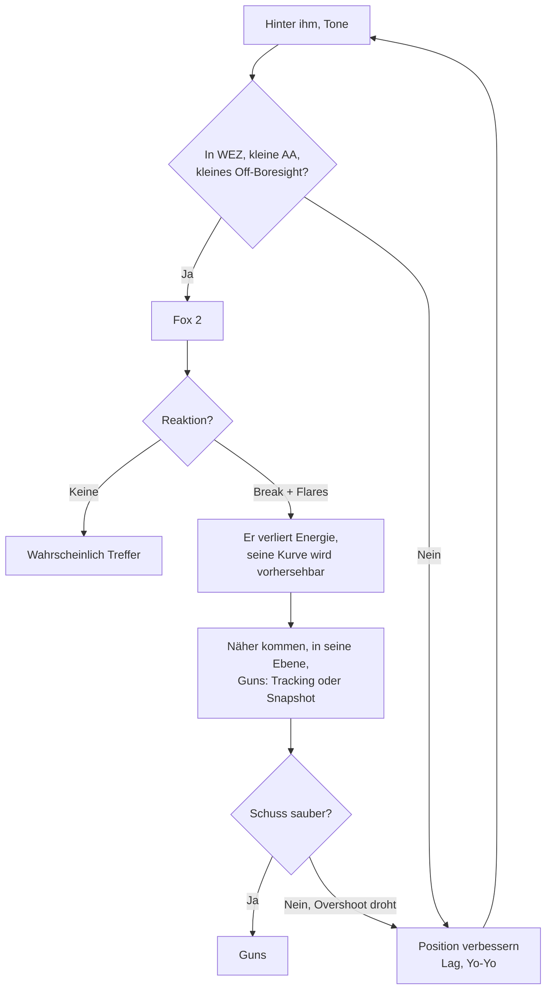

# Schusslösung: Guns und Fox 2

> Position ist nur die Vorarbeit. Hier geht es darum, wann und wie du triffst.

VFM hat zwei Waffen: die **Bordkanone** (Guns) und **einen Typ IR-Rakete** ("Heater", Brevity beim Abschuss: **Fox 2**). Es gibt keine Radar-Raketen und kein Chaff. Was in einer Lobby erlaubt ist, legt der Host fest. Details zu Bedienung und Anzeigen stehen unter [Waffen](/avionik/waffen) und [HUD](/avionik/hud).

## Grundregel: in seiner Ebene

Egal ob Kanone oder Rakete: Der einfachste Schuss entsteht, wenn du **in seiner Bewegungsebene** fliegst, also dein Lift Vector auf ihm liegt und deine Kurve in derselben Ebene liegt wie seine. Dann bewegt er sich relativ zu dir nur nach vorn oder hinten entlang deiner Nase, nicht seitlich. Du musst nur noch die richtige Menge Lead (Vorhalt) ziehen. Wer außerhalb seiner Ebene schießt, muss gleichzeitig in zwei Richtungen korrigieren, und die Geschosse laufen seitlich an ihm vorbei.

Siehe [Relative Geometrie](/grundlagen/geometrie) für Bewegungsebene, AA und WEZ.

## Guns

### Das Visier: Funnel

Alle drei Jets haben ein EEGS-artiges Kanonenvisier, den **Funnel**: zwei Linien, die zeigen, wo dein Geschossstrom in den nächsten Momenten liegt, wenn du deine aktuelle Kurve beibehältst. Wo der Funnel so breit ist wie die Spannweite des Gegners, liegt die passende Entfernung für dieses Ziel.

- **Mit Radar-Lock** kennt das Visier die Entfernung und liefert eine Feuerleitlösung.
- **Ohne Lock** rechnet der Funnel mit einer durchschnittlichen Spannweite (seit v1.2.8). Das ist eine Näherung: Die drei Jets sind unterschiedlich groß.
- Das **Gun-Boresight-Kreuz** (seit v1.3.1) zeigt, wohin die Kanone ohne Vorhalt zeigt.

::: info IM SPIEL PRÜFEN
- Wie sich Funnel mit und ohne Lock im Detail unterscheiden. Das Gunsight-Tutorial in der Academy (seit v1.2.8) erklärt die Anzeige.
- Ob ein Lock in deinem Setup den Kanonenschuss spürbar verbessert, oder ob du ohne Lock genauso triffst.
:::

### Tracking Shot

- **Wann:** Du sitzt hinter ihm, **in seiner Ebene**, mit **kleiner AA**, und kannst seine Kurve mitgehen.
- **Wie:** Lift Vector auf ihn, ziehen, bis der Funnel auf ihm liegt und seine Flächen den Funnel an der Stelle ausfüllen, wo er sitzt. Halten, kurze Feuerstöße, nachkorrigieren.
- **Woran du es erkennst:** Der Funnel **bleibt** auf dem Ziel. Die Relativbewegung ist klein.

### Snapshot

- **Wann:** Hohe AA bzw. hohe Sichtlinienrate. Du kannst den Funnel **nicht** auf ihm halten, weil er schneller durch dein Sichtfeld läuft, als du nachdrehen kannst.
- **Wie:** In seiner Ebene den Funnel **vor ihn** legen und ihn hineinfliegen lassen. Feuer kurz **bevor** er den Funnel erreicht, damit der Geschossstrom dort ist, wenn er durchfliegt.
- **Woran du es erkennst:** Der Funnel läuft **durch** das Ziel, statt darauf zu bleiben.
- **Preis:** Geringere Trefferwahrscheinlichkeit, und der Lead, den du dafür ziehst, treibt dich Richtung [Overshoot](/grundlagen/offensiv/overshoot). Ein Snapshot ist eine Gelegenheit, keine Taktik.

::: warning SCHUSSTYP HÄNGT VOM WINKEL AB, NICHT VON DER ENTFERNUNG
Tracking und Snapshot unterscheiden sich durch **Winkel und Relativbewegung**, nicht durch die Distanz. Auch auf kurze Entfernung kann ein sauberer Tracking Shot möglich sein, und auch auf mittlere Entfernung ein Snapshot.
:::

### Reichweite und Lead

- Je weiter weg er ist, desto länger fliegen die Geschosse, desto mehr Lead brauchst du und desto mehr kann er in der Zwischenzeit ändern.
- Richtwert aus dem realen BFM: Kanonenschüsse sind meist erst unter etwa 3.000 ft wirklich aussichtsreich, besser deutlich näher. **Richtwert, im Spiel testen.** VFM nennt keine offizielle effektive Reichweite.
- Feuere in **kurzen Stößen**. Munition hat Gewicht und ist endlich, und mit leeren Stores startet ein Selbstzerstörungs-Countdown. Es gibt kein Nachladen.

::: info IM SPIEL PRÜFEN
- Auf welche Entfernung du mit der Kanone gegen einen kurvenden Bot noch zuverlässig triffst. Teste es im Replay: Entfernung beim Treffer ablesen.
- Wie viele Feuersekunden die Munition hergibt (hängt von den Match-Einstellungen ab, Infinite Ammo ist einstellbar).
- Ab wann genau der Selbstzerstörungs-Countdown startet (nur alle Waffen leer?).
:::

### Head-on Guns

Frontalschüsse im Vorbeiflug (Merge) können in Custom-Lobbys **erlaubt oder verboten** sein. Zusätzlich gibt es die Einstellung **Merge Safety**, seit v1.4.1 standardmäßig an. Prüf vor dem Match, was gilt. Wenn Head-on Guns erlaubt sind:

- Ein Frontalschuss ist ein Snapshot mit sehr hoher Closure. Kurzer Stoß, dann aus seiner Schusslinie heraus. Siehe [Der Merge](/grundlagen/neutral/der-merge).
- Wenn er dir frontal entgegenkommt und schießen kann: nicht geradeaus auf ihn zufliegen, sondern aus seiner Ebene heraus versetzen.

::: info IM SPIEL PRÜFEN
- Was "Merge Safety" genau bewirkt.
:::

## Fox 2 (IR-Rakete)

### Tone

Der Suchkopf der Rakete muss das Ziel erfassen, bevor du schießt. Üblich ist ein **Ton** ("Tone"/"Growl"), der lauter bzw. höher wird, wenn der Suchkopf das Ziel aufgeschaltet hat. Kein Tone, kein Schuss.

### WEZ der Rakete

Die WEZ (Weapons Engagement Zone) ist der Bereich, in dem ein Schuss physikalisch treffen kann. Sie hat mehrere Grenzen:

- **Minimalreichweite:** Die Rakete braucht Strecke, um sich zu schärfen und auf das Ziel einzudrehen. Zu nah, und sie fliegt vorbei. Ein One-Circle-Kampf kann so eng werden, dass du unter diese Grenze rutschst. Siehe [One-Circle / Two-Circle](/grundlagen/neutral/one-two-circle).
- **Maximalreichweite:** Hängt stark von Aspect, Höhe und Speeds ab. Gegen einen Gegner, der von dir wegfliegt, ist sie deutlich kürzer, weil die Rakete ihn einholen muss.
- **Off-Boresight:** Wie weit neben deiner Nase der Suchkopf ein Ziel aufschalten kann. Je weiter außen, desto mehr muss die Rakete nach dem Start kurven, desto mehr Energie verliert sie.
- **Aspect:** Klassische IR-Raketen brauchen den heißen Triebwerksbereich, also einen Schuss von hinten.

::: info IM SPIEL PRÜFEN
- Die Community berichtet, dass die IR-Rakete in VFM auch frontal (all-aspect) trifft. Offiziell bestätigt ist das nicht. Teste es gegen Bots: Tone von vorn? Treffer von vorn?
- Ingame-Name der Rakete, Anzeige der WEZ im HUD, Tone-Darstellung, maximaler Off-Boresight-Winkel und Minimalreichweite.
- Ob dein Schubniveau (Idle vs. volle Leistung) beeinflusst, wie gut die Rakete dich sieht.
:::

### Der gute Fox-2-Schuss

- Gegner **vor dir, kleine AA**, nicht in einer harten Kurve.
- Off-Boresight **klein**, also Ziel nahe an deiner Nase.
- Mitten in der WEZ, nicht am Rand.
- Er hat **keine Flares mehr** oder sieht dich nicht.

## Schusslogik: Fox 2 zwingt, Guns tötet

Eine IR-Rakete ist nicht nur Kill-Chance. Sie ist auch ein Werkzeug, um den Gegner zu etwas zu zwingen. Gegen einen Fox 2 muss er reagieren: brechen, Flares werfen, Gas raus. Das kostet ihn Energie und Position. Genau dann kommst du näher und holst dir den Gun-Schuss.

```mermaid
flowchart TD
    A["Hinter ihm, Tone"] --> B{"In WEZ, kleine AA,<br/>kleines Off-Boresight?"}
    B -->|Ja| F2["Fox 2"]
    B -->|Nein| POS["Position verbessern<br/>Lag, Yo-Yo"]
    POS --> A
    F2 --> R{"Reaktion?"}
    R -->|"Keine"| HIT["Wahrscheinlich Treffer"]
    R -->|"Break + Flares"| E["Er verliert Energie,<br/>seine Kurve wird vorhersehbar"]
    E --> G["Näher kommen, in seine Ebene,<br/>Guns: Tracking oder Snapshot"]
    G --> CHK{"Schuss sauber?"}
    CHK -->|Ja| GUN["Guns"]
    CHK -->|"Nein, Overshoot droht"| POS
```

- **Nicht alle Raketen auf einmal.** Ein zweiter Schuss in seinen Flare-Strom hinein ist meist verschwendet. Warte, bis er aus dem Break kommt.
- **Ohne Raketen hast du nur noch Guns.** Wer früh alles verschießt, steht später gegen einen Gegner mit Raketen schlecht da.
- Raketenanzahl und ob Raketen überhaupt erlaubt sind, sind Match-Einstellungen.

## Ranked: Guns-only

Ranked 1v1 wird als **Guns-only** berichtet. Dort zählen ausschließlich Kanonenschüsse, also: Position, Ebene, Funnel. Die Fox-2-Logik oben gilt für Lobbys mit Raketen.

::: info IM SPIEL PRÜFEN
- Ob Ranked aktuell wirklich Guns-only ist und ob es Unterschiede zwischen 1v1 und anderen Ranked-Modi gibt. Siehe [Spielmodi](/einstieg/spielmodi).
:::

## Typische Fehler

- **Schießen außerhalb seiner Ebene.** Die Geschosse laufen seitlich vorbei, auch wenn der Funnel scheinbar "fast" passt.
- **Dauerfeuer.** Kostet Munition und Gewicht, bringt selten mehr Treffer als kurze, gezielte Stöße.
- **Tracking bis in den Overshoot.** Wenn die Closure hoch ist, lieber den Schuss aufgeben und die Position halten.
- **Fox 2 aus großem Off-Boresight oder am Rand der Reichweite.** Die Rakete kommt mit wenig Energie an, und ein Break reicht.
- **Nach dem Schuss nicht weiterfliegen.** Nach dem Schuss ist vor dem Schuss: Position halten, Sicht halten, auf seine Reaktion antworten.

::: tip MERKE
- Erst in seine Ebene, dann schießen.
- Tracking: Funnel bleibt auf ihm (kleine AA). Snapshot: Funnel läuft durch ihn (hohe AA). Winkel entscheidet, nicht Entfernung.
- Fox 2 nur mit Tone, mitten in der WEZ, mit kleinem Off-Boresight. All-Aspect im Spiel prüfen.
- Fox 2 zwingt ihn in Flares und Break, dann Guns.
- Kurze Stöße. Leere Stores lösen den Selbstzerstörungs-Countdown aus.
:::

Weiter: [Defensive Manöver](/grundlagen/defensiv-manoever)
