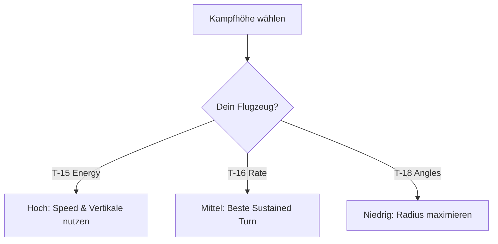

# Physik-Simulation

> Aerodynamische Grundlagen in Virtual Fighter Maneuvers.

VFM unterscheidet sich von arcade-lastigen Flugspielen durch die tiefe Integration physikalisch korrekter Aerodynamik. Das Verständnis dieser Prinzipien ist der Schlüssel zum Sieg.

---

## Transsonischer Bereich

Der Übergang zwischen Unterschall und Überschall (Mach 0.9 bis Mach 1.2) ist die kritischste Zone der Flugphysik.

### Drag Rise (Wellenwiderstand)

Wenn sich ein Flugzeug der Schallgeschwindigkeit nähert, entstehen lokale Stoßwellen auf den Tragflächen. Der Luftwiderstand steigt exponentiell an.

```
Widerstand
    ↑
    │         ╱╲
    │        ╱  ╲
    │       ╱    ╲___________
    │      ╱
    │_____╱
    └────────────────────────→ Mach
         0.9  1.0  1.2
              ↑
         Drag Rise
```

| Mach-Bereich | Widerstandsverhalten |
|--------------|---------------------|
| **< 0.9** | Normal, linear |
| **0.9 - 1.0** | Stark ansteigend (Drag Rise) |
| **1.0 - 1.2** | Maximum des Widerstands |
| **> 1.2** | Sinkt wieder, stabilisiert sich |

### Taktische Implikation

- **Beschleunigung durch die Schallmauer** erfordert massiven Schubüberschuss
- **Energieverlust im Transsonik** ist enorm bei Manövern
- **Erfahrene Piloten** bleiben entweder unter Mach 0.9 oder deutlich über Mach 1.2

::: warning FALLE
Ein Flugzeug, das in einer engen Kurve in den transsonischen Bereich zurückfällt, verliert rapide Geschwindigkeit und wird zum leichten Ziel.
:::

---

## Anstellwinkel (Angle of Attack - AoA)

Der Anstellwinkel ist der Winkel zwischen der Flügelsehnenlinie und der anströmenden Luft. Er bestimmt, wie viel Auftrieb die Tragfläche erzeugt.

### Auftriebskurve

```
Auftrieb (CL)
    ↑
    │        ╱╲ ← Kritischer AoA
    │       ╱  ╲
    │      ╱    ╲
    │     ╱      ╲
    │    ╱        ╲
    │   ╱          ↘ Stall
    │  ╱
    └─────────────────────→ AoA (°)
       0    15   25   35
```

| AoA-Bereich | Verhalten |
|-------------|-----------|
| **Niedrig (0-15°)** | Linearer Auftrieb, stabile Steuerung |
| **Mittel (15-25°)** | Hoher Auftrieb, erhöhter Widerstand |
| **Kritisch (25-35°)** | Maximum Auftrieb, Strömungsabriss droht |
| **Post-Stall (>35°)** | Strömung reißt ab, Kontrollverlust |

### Stall (Strömungsabriss)

Ab dem kritischen AoA kann die Luft der Flügelkontur nicht mehr folgen. Die Strömung reißt ab.

| Symptom | Beschreibung |
|---------|--------------|
| **Buffet** | Rütteln durch turbulente Strömung |
| **Auftriebsverlust** | Flugzeug "fällt durch" |
| **Kontrollverlust** | Steuerung wird wirkungslos |
| **Trudeln** | Mögliche Folge bei asymmetrischem Stall |

::: tip BUFFET
Das haptische Feedback (Controller-Vibration) warnt dich vor dem Stall. Lerne, das Buffet zu "fühlen".
:::

### High-Alpha Fähigkeit

Bestimmte Flugzeuge (besonders die T-18) können auch jenseits des kritischen AoA steuerbar bleiben:

- **Vortex-Lift:** Wirbel an LERX stabilisieren die Strömung
- **Flight Control System:** Computergsteuerte Korrektur
- **Trade-off:** Extrem hoher induzierter Widerstand

---

## Variable Massendynamik

VFM simuliert das Gewicht von Treibstoff und Munition in Echtzeit.

### Gewichtseinfluss

| Faktor | Bei hohem Gewicht | Bei niedrigem Gewicht |
|--------|-------------------|----------------------|
| **Trägheit** | Höher | Niedriger |
| **Wenderadius** | Größer | Kleiner |
| **Beschleunigung** | Langsamer | Schneller |
| **T/W Ratio** | Schlechter | Besser |

### Gewichtsabnahme im Kampf

```
Gewicht
    ↑
    │███████████████  ← Start (Voll beladen)
    │██████████████   ← Nach Treibstoffverbrauch
    │█████████████    ← Nach Raketeneinsatz
    │████████████     ← Späte Kampfphase
    │███████████      ← Ende (Leicht & agil)
    └────────────────────────→ Zeit
```

### Taktische Implikation

- **Anfangs:** Schwerfällig, große Kurvenradien
- **Später:** Höheres T/W-Verhältnis, extreme Agilität
- **Strategie:** Ein "schwerfälliges" Flugzeug wird gegen Ende deutlich gefährlicher

::: info TREIBSTOFF
Erfahrene Piloten wissen, wann ihr Flugzeug "leicht" wird und nutzen diesen Moment für aggressive Manöver.
:::

---

## Atmosphärenmodell

Die Luftdichte variiert mit der Höhe und beeinflusst alle aerodynamischen Effekte.

### Höheneffekte

| Höhe | Luftdichte | Effekt |
|------|------------|--------|
| **Bodennähe** | Hoch | Knackige Manöver, hoher Widerstand |
| **Mittlere Höhe** | Mittel | Ausgewogen |
| **Große Höhe** | Niedrig | Weite Radien, höhere Endgeschwindigkeit |

### Im Detail

| Aspekt | Niedrig (Dichte hoch) | Hoch (Dichte niedrig) |
|--------|----------------------|----------------------|
| **Auftrieb** | Mehr verfügbar | Weniger verfügbar |
| **Widerstand** | Höher | Niedriger |
| **Triebwerksleistung** | Normal | Reduziert (weniger O₂) |
| **Wenderate** | Hoch möglich | Eingeschränkt |
| **Topspeed** | Begrenzt | Höher erreichbar |

### Taktische Implikation



::: warning HÖHENKAMPF
Kämpfe in großer Höhe sind träge und "schlampig". Wer dort nicht hingehört (T-18), sollte runterziehen.
:::

---

## Zusammenfassung: Physik-Bewusstsein

| Konzept | Kernaussage |
|---------|-------------|
| **Transsonik** | Mach 0.9-1.2 frisst Energie |
| **AoA** | Mehr Winkel = mehr Auftrieb, aber Stall droht |
| **Masse** | Leichter = agiler, schwerer = träger |
| **Höhe** | Niedrig = knackig, hoch = träge |

::: tip PHYSIK VERSTEHEN = GEWINNEN
VFM ist weniger ein Spiel darüber, wer am besten zielen kann, sondern wer am besten fliegen kann. Wer die Physik versteht, dominiert den Kampf.
:::
