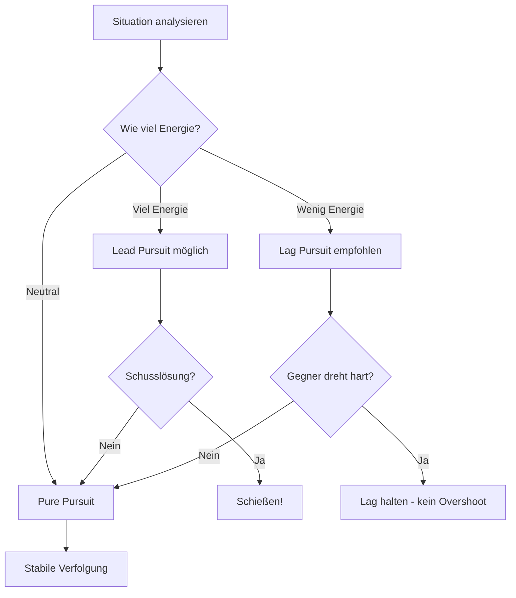
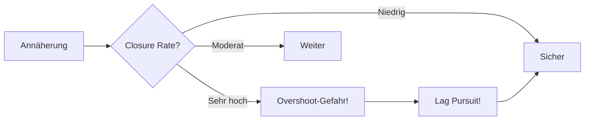

# Pursuit Curves (Verfolgungskurven)

Pursuit Curves beschreiben, wie du deine Nase relativ zum Gegner ausrichtest. Die richtige Wahl beeinflusst Annäherungsrate, Energie und Schusslösung.

## Die drei Pursuit-Typen

### Lead Pursuit

Du zielst **vor** den Gegner (in seine Flugrichtung).

```
     Gegner →
        ↗
    Deine Nase
```

**Effekt:**
- Schnellste Annäherung
- Höchster Energie-Verlust
- Führt zu Overshoot wenn zu aggressiv

::: tip WANN NUTZEN
- Schusslösung herstellen (Gun)
- Gegner ist langsam/dreht vorhersehbar
- Du hast Energie-Überschuss
:::

---

### Pure Pursuit

Du zielst **direkt auf** den Gegner.

```
     Gegner →
        ↑
    Deine Nase
```

**Effekt:**
- Mittlere Annäherung
- Mittlerer Energie-Verlust
- Stabile Verfolgung

::: tip WANN NUTZEN
- Standardverfolgung
- Gegner-Verhalten beobachten
- Energie-neutral bleiben
- Raketen-Aufschaltung
:::

---

### Lag Pursuit

Du zielst **hinter** den Gegner.

```
     Gegner →
        ↖
    Deine Nase
```

**Effekt:**
- Langsamste Annäherung
- Niedrigster Energie-Verlust
- Baut Separation auf oder hält Abstand

::: tip WANN NUTZEN
- Energie sparen
- Overshoot vermeiden
- Gegner zur Reaktion zwingen
- In der Control Zone bleiben
:::

---

## Pursuit-Entscheidung



## Das Pursuit-Problem: Overshoot

**Overshoot** = Du fliegst am Gegner vorbei und wirst zum Ziel.

### Warum passiert Overshoot?

1. Zu viel Lead Pursuit
2. Zu hohe Geschwindigkeit
3. Gegner bremst plötzlich (Break Turn)

### Overshoot verhindern



**Lag Pursuit** ist dein Werkzeug gegen Overshoot:
- Ziele hinter den Gegner
- Deine Nase zeigt "behind the 3/9 line"
- Du verlierst Closure Rate
- Gegner kann nicht plötzlich hinter dich kommen

## Pursuit vs Flugzeugtyp

| Gegner-Typ | Empfohlene Pursuit | Begründung |
|------------|-------------------|------------|
| **Rate Fighter** | Lag/Pure | Er dreht gut - Overshoot-Gefahr |
| **Angles Fighter** | Lag! | Er bremst extrem - hohes Overshoot-Risiko |
| **Energy Fighter** | Abhängig von Energie | Kann schnell beschleunigen und entkommen |

::: warning GEGEN ANGLES FIGHTER
Angles Fighter werden im Turn extrem langsam und können hohe Anstellwinkel fliegen. Wenn du mit hoher Geschwindigkeit in Lead Pursuit anfliegst, wirst du **garantiert** overshooten. Nutze **Lag Pursuit** und halte Distanz!
:::

## Die Goldene Regel für Anfänger

::: danger NICHT SOFORT LEAD ZIEHEN!
Der Instinkt sagt: "Zieh vor ihn, um zu schießen!"

Aber wenn du das zu früh machst:
- Du schneidest die Kurve zu eng
- Du wirst relativ zum Ziel zu schnell
- Du schießt über das Ziel hinaus

**Besser:**
1. Beginne in **Lag Pursuit** (Position sichern)
2. Wechsle zu **Pure Pursuit** (Rakete/Stabilisierung)
3. Gehe erst im letzten Moment in **Lead Pursuit** (Gun)
:::

## Zusammenfassung

| Pursuit | Energie | Annäherung | Risiko |
|---------|---------|------------|--------|
| Lead | Hoch verbraucht | Schnell | Overshoot |
| Pure | Neutral | Mittel | Ausgeglichen |
| Lag | Spart Energie | Langsam | Separation |

::: info PHILOSOPHIE
Nutze Lag Pursuit um Energie zu sparen und Position zu kontrollieren. Wechsle zu Lead nur für die finale Schusslösung.
:::
