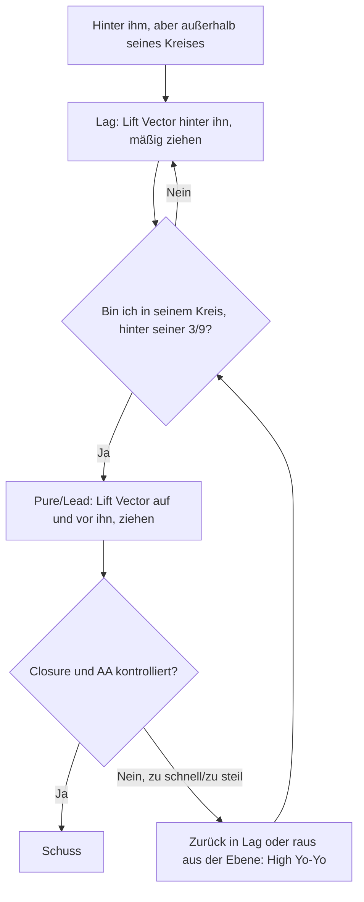

# Verfolgungskurven

> Lead, Pure, Lag: Wohin deine Nase und dein Lift Vector relativ zum Gegner zeigen, bestimmt Closure, Winkel und ob du hinter ihm bleibst.

Wenn du hinter einem kurvenden Gegner bist, hast du in jedem Moment drei Möglichkeiten: vor ihn zielen, auf ihn zielen oder hinter ihn zielen. Diese Wahl – die **Verfolgungskurve** (Pursuit Curve) – ist das wichtigste Werkzeug des Angreifers. Grundbegriffe wie AA und Closure: [Relative Geometrie](/grundlagen/geometrie).

## Die drei Verfolgungskurven

Die Verfolgungskurve ist über die Richtung deiner **Nase und deines Lift Vectors relativ zum Gegner** definiert. Wohin du den Lift Vector legst und ziehst, dorthin wandert deine Nase.

- **Lead Pursuit:** Nase und Lift Vector **vor** den Gegner – in seine Kurve hinein, dorthin, wo er gleich sein wird.
- **Pure Pursuit:** Nase und Lift Vector **direkt auf** den Gegner.
- **Lag Pursuit:** Nase und Lift Vector **hinter** den Gegner – Richtung seines Hecks, außerhalb seines Kreises.

<svg viewBox="0 0 520 325" width="100%" style="max-width:520px" role="img" aria-label="Draufsicht: Der Bandit fliegt oben auf seinem Kurvenkreis nach links. Du bist rechts hinter ihm. Drei Pfeile von dir: Lead zeigt vor ihn in seinen Kreis, Pure zeigt direkt auf ihn, Lag zeigt hinter ihn außerhalb seines Kreises.">
<defs><marker id="vk-ah" viewBox="0 0 10 10" refX="9" refY="5" markerWidth="7" markerHeight="7" orient="auto-start-reverse"><path d="M0,0 L10,5 L0,10 z" fill="currentColor"/></marker><marker id="vk-ahb" viewBox="0 0 10 10" refX="9" refY="5" markerWidth="7" markerHeight="7" orient="auto-start-reverse"><path d="M0,0 L10,5 L0,10 z" fill="var(--vp-c-brand-1)"/></marker><marker id="vk-ahg" viewBox="0 0 10 10" refX="9" refY="5" markerWidth="7" markerHeight="7" orient="auto-start-reverse"><path d="M0,0 L10,5 L0,10 z" fill="var(--vp-c-text-2)"/></marker><marker id="vk-ahd" viewBox="0 0 10 10" refX="9" refY="5" markerWidth="7" markerHeight="7" orient="auto-start-reverse"><path d="M0,0 L10,5 L0,10 z" fill="var(--vp-c-danger-1)"/></marker></defs>
<circle cx="260" cy="170" r="110" fill="none" stroke="var(--vp-c-text-2)" stroke-width="1" stroke-dasharray="6 4"/>
<line x1="254" y1="170" x2="266" y2="170" stroke="var(--vp-c-text-2)" stroke-width="1"/>
<line x1="260" y1="164" x2="260" y2="176" stroke="var(--vp-c-text-2)" stroke-width="1"/>
<text x="260" y="192" font-size="12" fill="var(--vp-c-text-2)" text-anchor="middle">seine Kurvenmitte</text>
<polygon points="246,60 270,52 270,68" fill="var(--vp-c-danger-1)"/>
<path d="M 240.9 61.7 A 110 110 0 0 0 189.3 85.7" fill="none" stroke="var(--vp-c-danger-1)" stroke-width="2" marker-end="url(#vk-ahd)"/>
<text x="232" y="50" font-size="12" fill="var(--vp-c-danger-1)" text-anchor="end">Bandit</text>
<circle cx="440" cy="120" r="6" fill="var(--vp-c-brand-1)"/>
<text x="452" y="124" font-size="12" fill="var(--vp-c-brand-1)">Du</text>
<line x1="433" y1="120" x2="192" y2="111" stroke="var(--vp-c-brand-1)" stroke-width="2" marker-end="url(#vk-ahb)"/>
<text x="196" y="132" font-size="12" fill="var(--vp-c-brand-1)">Lead</text>
<line x1="433" y1="118" x2="278" y2="66" stroke="currentColor" stroke-width="2" marker-end="url(#vk-ah)"/>
<text x="340" y="83" font-size="12" fill="currentColor">Pure</text>
<line x1="435" y1="115" x2="332" y2="42" stroke="var(--vp-c-text-2)" stroke-width="2" marker-end="url(#vk-ahg)"/>
<text x="338" y="36" font-size="12" fill="var(--vp-c-text-2)">Lag</text>
<text x="260" y="302" font-size="12" fill="var(--vp-c-text-2)" text-anchor="middle">Bandit dreht links. Lead: vor ihn, in seinen Kreis. Pure: auf ihn.</text>
<text x="260" y="318" font-size="12" fill="var(--vp-c-text-2)" text-anchor="middle">Lag: hinter ihn, Richtung seines Hecks, außerhalb seines Kreises.</text>
</svg>

## Was jede Kurve bewirkt

| | Lead | Pure | Lag |
|---|---|---|---|
| **Closure** | steigt | mittel, steigt am Ende einer Verfolgung | sinkt |
| **AA** | steigt (du schneidest vor ihn) | treibt dich Richtung seiner Six | sinkt (du fällst hinter ihn) |
| **G-Bedarf** | mehr als er – du musst enger drehen | etwa wie er | weniger als er |
| **Wofür** | Gun-Schuss, Abstand schließen | Fox-2-Schuss, kurze Übergänge | Position, Turn Circle Entry, Overshoot vermeiden |
| **Risiko** | Overshoot | Overshoot bei viel Speed-Überschuss | Gegner entkommt, wenn du zu lange zu weit hinten bleibst |

### Lead Pursuit

Die Kanone braucht Vorhalt: Die Geschosse fliegen dorthin, wo er **sein wird**. Deshalb gibt es einen Gun-Schuss nur aus Lead. Gleichzeitig steigen Closure und AA – genau die Zutaten für einen [Overshoot](/grundlagen/offensiv/overshoot).

Nutze Lead, wenn:

- du in **Gun-Reichweite** bist und die Schusslösung in kurzer Zeit wirklich kommt,
- der Gegner **davonzieht** und du Abstand schließen musst – dann kurz Lead, aber mit Blick auf die Closure.

### Pure Pursuit

Die Nase direkt auf ihm – so sieht der Suchkopf der IR-Rakete ihn am besten. Pure Pursuit treibt dich auf Dauer in seine Six. Hast du dabei viel mehr Speed als er, steigt die Closure am Ende stark.

Nutze Pure, wenn:

- du einen **Fox-2-Schuss** vorbereitest,
- du kurz von Lag nach Lead (oder umgekehrt) wechselst.

### Lag Pursuit

Die Nase hinter ihm. Du fliegst um seinen Kreis herum statt hinein, die Closure sinkt, die AA wird kleiner. Weil du weniger eng drehen musst als er, kostet Lag dich weniger G und damit weniger Energie.

Nutze Lag, wenn:

- du **außerhalb seines Kreises** bist und hinein musst (Turn Circle Entry, siehe unten),
- die **Closure zu hoch** ist und ein Overshoot droht,
- du in der [Control Zone](/grundlagen/geometrie#control-zone) bleiben und warten willst, bis er Energie verliert oder einen Fehler macht.

## Turn Circle Entry

Die Grundregel: **In Lag, bis du in seinem Kreis bist – dann Lead.**

```mermaid
flowchart TD
    A[Hinter ihm, aber außerhalb seines Kreises] --> B[Lag: Lift Vector hinter ihn, mäßig ziehen]
    B --> C{Bin ich in seinem Kreis, hinter seiner 3/9?}
    C -->|Nein| B
    C -->|Ja| D[Pure/Lead: Lift Vector auf und vor ihn, ziehen]
    D --> E{Closure und AA kontrolliert?}
    E -->|Ja| F[Schuss]
    E -->|Nein, zu schnell/zu steil| G[Zurück in Lag oder raus aus der Ebene: High Yo-Yo]
    G --> C
```

Warum nicht sofort Lead? Weil du von außerhalb seines Kreises nur mit viel G und hoher AA vor ihn kommst. Du kreuzt seine Flugbahn (Flight-Path-Overshoot), er kehrt die Kurve um – und auf einmal steht ihr neutral oder du bist vor ihm.

So erkennst du, dass du in seinem Kreis bist:

- Du kannst die Nase mit moderatem G **auf ihn** bringen, ohne dass er auf dem Kabinendach nach hinten wandert.
- Seine Flugbahn liegt **vor dir**, nicht neben dir.

## Out of Plane: Pursuit in 3D

Verfolgungskurven funktionieren nicht nur flach. Oft ist der bessere Weg zu Lag, den Lift Vector **über** ihn zu rollen und zu ziehen: Du baust Closure ab, ohne Speed zu verlieren, weil sie als Höhe erhalten bleibt. Das ist der [High Yo-Yo](/grundlagen/offensiv/yo-yos). Umgekehrt holt der Low Yo-Yo (Lift Vector unter ihn) Closure zurück, wenn du zu weit hinten bist. Bist du schon in Lead oder Pure mit zu hoher AA, bringt dich der [Lag Roll](/grundlagen/offensiv/lag-roll) zurück in Lag.

## Overshoot in Kürze

Zu viel Lead, zu viel Closure oder ein guter Break des Gegners – und du schießt vorbei:

- **Flight-Path-Overshoot:** Du kreuzt seine Flugbahn hinter ihm. Du verlierst Winkelvorteil, bist aber noch hinter seiner 3/9-Linie.
- **3/9-Line-Overshoot:** Du schießt an seiner 3/9-Linie vorbei und bist vor ihm. Rollentausch.

Erkennen, vermeiden, retten: [Overshoot](/grundlagen/offensiv/overshoot).

## Typische Fehler

- **Sofort Lead ziehen**, sobald der Gegner zu sehen ist – von außerhalb seines Kreises. Ergebnis: hohe AA, Overshoot.
- **Ewig in Lag hängen** – du sparst Energie, aber er gewinnt Zeit und dreht weg. Lag ist ein Weg in den Kreis, kein Ziel.
- **Nur flach denken** – der High Yo-Yo löst viele Closure-Probleme eleganter als Gas raus.

::: tip MERKE
- **Lead** = vor ihn: Closure und AA steigen. Für den Gun-Schuss.
- **Pure** = auf ihn: für den Fox-2-Schuss und Übergänge.
- **Lag** = hinter ihn: Closure und AA sinken. Für Position und Turn Circle Entry.
- **Lag, bis du in seinem Kreis bist – dann Lead.**
- Zu viel Closure? Raus aus der Ebene (High Yo-Yo) statt in den Overshoot.
:::

Weiter: [Offensive Manöver](/grundlagen/offensiv-manoever)
