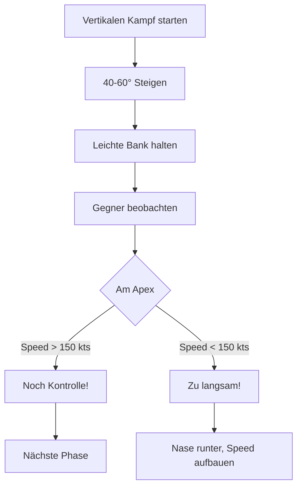

# Taktische Spirale

Die Vertikale ist ein mächtiges Werkzeug im BFM. Statt gerade hoch zu fliegen (Pure Vertical), fliege ein "Ei" - eine spiralförmige Steigkurve.

## Der kritische Fehler: Pure Vertical

::: danger FEHLER: Stumpfes Hochziehen
Einfach 90° hochziehen ist **gefährlich**!

**Was passiert:**
- Bei 0 Knoten hast du **keine Kontrolle**
- Du bist ein **stationäres Ziel**
- Gegner kann dich leicht abschießen
:::

## Die Lösung: Die Taktische Spirale ("The Egg")

### Das Konzept

```
        ___
       /   \     ← Apex (aber mit Speed!)
      |     |
       \   /     ← Du siehst den Gegner
        | |
        |_|      ← Start
```

### Ausführung

1. **Steigwinkel: 40-60°** - Nicht 90°!
2. **Leichte Querneigung** (Bank) beibehalten
3. **Rollrichtung** - So dass du den Gegner siehst
4. **Speed-Minimum: 150-180 kts** am Apex


