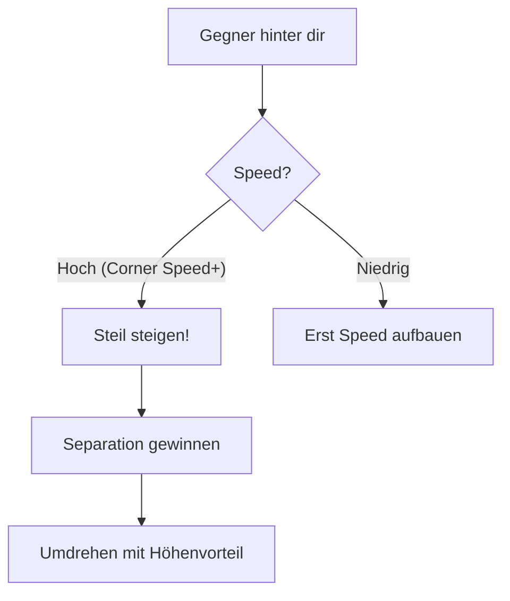

# Zoom Climb

Nutze überschüssige Energie für schnellen Höhengewinn.

## Ausführung

1. Bei hoher Speed (Corner Speed+) hochziehen
2. Steile Steigung (60-70°)
3. Vor Speed-Verlust abflachen
4. Höhenvorteil gewonnen

::: tip WANN NUTZEN
- Nach High-Speed-Pass
- Gegner ist tiefer und langsamer
- Du willst Separation
:::

## High-Speed Climb Out (Defensiv)

**Warum es funktioniert:**
- Flugzeuge mit hohem TWR steigen schneller
- Einmotorige Flugzeuge haben Schwierigkeiten zu folgen
- Du gewinnst Zeit und Position

::: warning VORAUSSETZUNG
Du brauchst **genug Energie** (Speed) um vertikal zu flüchten. Versuche nicht, mit 250 kts zu steigen - du wirst nur langsamer und verletzlicher.
:::
