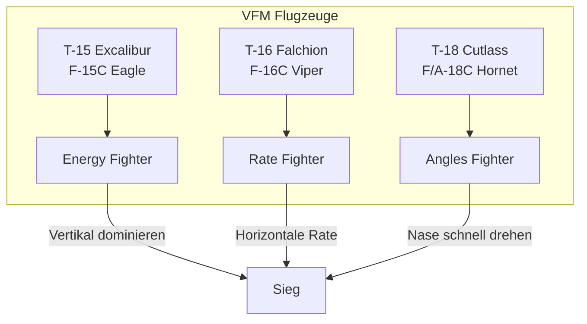

# VFM Flight Academy

> Taktische Doktrin für Virtual Fighter Maneuvers

Werde zum Ass in **Virtual Fighter Maneuvers** (VFM). Diese Wiki dokumentiert die taktische Doktrin mit Fokus auf die **T-15 Excalibur** (F-15C Eagle).

::: info ÜBER VFM
Virtual Fighter Maneuvers von Boundless Dynamics simuliert komplexe aerodynamische Faktoren wie transsonischen Widerstand, Anstellwinkel (AoA), Schub-Gewichts-Verhältnisse und spezifische Energiezustände. Prinzipien aus DCS und Falcon BMS gelten auch hier!
:::

## Schnellstart

::: tip NEU HIER?
1. Lerne die [Golden Rules](/golden-rules) - die 10 Gebote des Luftkampfs
2. Verstehe die [Kampf-Geometrie](/academy/geometry) - One-Circle vs Two-Circle
3. Kenne deinen Gegner: [T-16](/aircraft/t16-falchion) und [T-18](/aircraft/t18-cutlass)
:::

## Die Kernhypothese

::: danger DER FUNDAMENTALE FEHLER
Misserfolg gegen T-16 und T-18 resultiert **nicht** aus mangelnder Aggressivität, sondern aus einem **fundamentalen Missverständnis** der DACT-Prinzipien.

Die T-15 ist ein Flugzeug der **Energiedominanz**. Der Versuch, sie wie einen "Angles Fighter" (T-18) oder "Rate Fighter" (T-16) zu fliegen, führt **zwangsläufig zur Niederlage**.
:::

## Die wichtigsten Konzepte

| Konzept | Beschreibung |
|---------|--------------|
| **Corner Speed** | Die Geschwindigkeit mit maximaler Turn Rate (~400-450 kts für T-15) |
| **One-Circle Flow** | Beide drehen voneinander weg - **Radius** entscheidet |
| **Two-Circle Flow** | Beide drehen aufeinander zu - **Rate** entscheidet |
| **Unloading** | 0G fliegen um Energie zurückzugewinnen |
| **Energy Fighting** | Nutze Höhe und Geschwindigkeit als taktische Ressource |

## Die drei Flugzeuge

| Merkmal | T-15 Excalibur | T-16 Falchion | T-18 Cutlass |
|---------|----------------|---------------|--------------|
| DCS Analog | F-15C Eagle | F-16C Viper | F/A-18C Hornet |
| Hauptstärke | Schub, Top Speed, Vertikale | Beste Wenderate | Bester Radius, High AoA |
| Bevorzugter Kampf | Vertikal, Boom & Zoom | Horizontal, 2-Circle | Langsam, 1-Circle |
| Gefahr für T-15 | - | Out-Rating | Nose-Authority |

## Quick Links

### Grundlagen
- [Golden Rules](/golden-rules) - Die 10 Gebote des Luftkampfs

### Aircraft Intel
- [T-15 Excalibur](/aircraft/t15-excalibur) - Das "Energie-Monster" (F-15C)
- [T-16 Falchion](/aircraft/t16-falchion) - Der "König der Rate" (F-16C)
- [T-18 Cutlass](/aircraft/t18-cutlass) - Der "Radius-Kämpfer" (F/A-18C)

### BFM Academy
- [Kampf-Geometrie](/academy/geometry) - One-Circle vs Two-Circle
- [Energy Management](/academy/energy-management) - Corner Speed & Unloading
- [Pursuit Curves](/academy/pursuit-curves) - Lead, Lag, Pure Pursuit

### Manöver
- [Offensive](/maneuvers/offensive) - High/Low Yo-Yo
- [Defensive](/maneuvers/defensive) - Scissors, Overshoot erzwingen
- [Vertikal](/maneuvers/vertical) - Die taktische Spirale

### Playbook
- [T-15 vs T-16](/playbook/t15-vs-t16) - Anti-Rate Taktik (Boom & Zoom)
- [T-15 vs T-18](/playbook/t15-vs-t18) - Anti-Radius Taktik (Two-Circle)
- [T-15 vs T-15](/playbook/t15-vs-t15) - Der Spiegelkampf

## Die goldenen Regeln der T-15

1. **Identifiziere den Gegner sofort** - T-16? Vertikal gehen. T-18? Schnell bleiben, Two-Circle.
2. **Nutze die Vertikale** - Zwei Triebwerke = vertikale Dominanz
3. **Beherrsche den High Yo-Yo** - Energie in Position umwandeln ohne Overshoot
4. **Vermeide "stumpfes Hochfliegen"** - Fliege Spiralen ("The Egg")
5. **Lerne das Unloading** - Pull - Unload - Pull

::: info DER SCHLÜSSEL ZUM SIEG
Der Schlüssel zum Sieg liegt nicht im **engeren Ziehen**, sondern im **klügeren Fliegen**. Lass T-16 und T-18 ihre Energie in engen Kurven verschwenden, während du von oben herabstößt, zuschlagst und wieder in die Sicherheit der Höhe verschwindest.
:::
