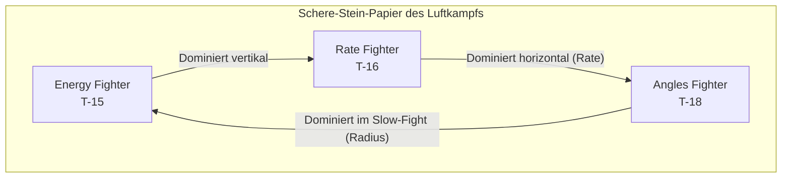

# VFM Flight Academy

> Taktische Doktrin für Virtual Fighter Maneuvers

Willkommen in der **Flight Academy**. Dieses Wiki dient als umfassendes Handbuch für Luftkampf-Taktiken in **Virtual Fighter Maneuvers** (VFM).

Es ist in fünf Hauptbereiche unterteilt:
1. **Einstieg**: Hardware, VR-Cockpit und Spielmodi.
2. **Grundlagen**: Physik, Energie-Management und Manöver-Theorie.
3. **Avionik**: Radar, Sensoren, Waffen und Gegenmaßnahmen.
4. **Flugzeuge**: Leistungsdaten und Charakteristiken der drei Muster.
5. **Taktiken**: Spezifische Kampfanleitungen für jedes Matchup.

::: info KONTEXT
VFM von Boundless Dynamics simuliert komplexe Aerodynamik: Transsonischer Widerstand, Anstellwinkel (AoA) und spezifische Energiezustände sind modelliert. Wir wenden hier echte BFM-Prinzipien (Basic Fighter Maneuvers) an.
:::

## Schnellstart

Für neue Piloten ist dies der empfohlene Pfad:

1. **Einstieg**: Prüfe die [Hardware-Anforderungen](/einstieg/hardware) und lerne die [Cockpit-Bedienung](/einstieg/cockpit).
2. **Grundlagen**: Lerne die [Golden Rules](/grundlagen/golden-rules) und verstehe die [Physik-Simulation](/grundlagen/physik).
3. **Geometrie**: Verstehe die [Kampf-Geometrie](/grundlagen/geometrie) (One-Circle vs. Two-Circle).
4. **Waffen**: Lerne [Guns & Raketen](/avionik/waffen) und [Flares](/avionik/gegenmassnahmen).
5. **Dein Flugzeug**: Wähle dein Muster und studiere die Leistungsdaten.
6. **Taktiken**: Lerne die spezifischen Taktiken gegen jeden Gegnertyp.

---

## Die Flugzeug-Typen (Archetypen)

Im Luftkampf gibt es drei fundamentale Design-Philosophien. Jedes Flugzeug in VFM verkörpert eines dieser Extreme.

| Archetyp | VFM Muster | Stärke | Schwäche |
|---|---|---|---|
| **Energy Fighter** | **[T-15 Excalibur](/flugzeuge/t15/daten)** | Schub, Vertikale, Speed | Wenderadius |
| **Rate Fighter** | **[T-16 Falchion](/flugzeuge/t16/daten)** | Beste Wenderate (Sustained) | Vertikale Ausdauer |
| **Angles Fighter** | **[T-18 Cutlass](/flugzeuge/t18/daten)** | Bester Radius (Instantaneous) | Energie-Erhalt |

---

## Modul-Übersicht

### Einstieg
Erste Schritte für neue Piloten.

- **[Hardware & System](/einstieg/hardware)**: Systemanforderungen für PCVR und Quest
- **[Cockpit-Bedienung](/einstieg/cockpit)**: VR-Interaktion und HOTAS
- **[Spielmodi](/einstieg/spielmodi)**: Singleplayer, Multiplayer, Ranglisten

### Grundlagen (Theorie)
Die theoretische Basis für alle Piloten - flugzeugneutral.

- **[Golden Rules](/grundlagen/golden-rules)**: Die 5 Eisernen Gesetze des Luftkampfs
- **[Physik-Simulation](/grundlagen/physik)**: Transsonik, AoA, Atmosphäre
- **[Kampf-Geometrie](/grundlagen/geometrie)**: One-Circle vs Two-Circle
- **[Energie-Management](/grundlagen/energie-management)**: Ps-Formel, Corner Speed & Unloading
- **[Verfolgungskurven](/grundlagen/verfolgungskurven)**: Lead, Lag und Pure Pursuit
- **[Offensiv-Manöver](/grundlagen/offensiv-manoever)**: High/Low Yo-Yo, Barrel Roll Attack
- **[Defensiv-Manöver](/grundlagen/defensiv-manoever)**: Scissors, Break Turn, Overshoot
- **[Vertikal-Manöver](/grundlagen/vertikal-manoever)**: Taktische Spirale

### Avionik & Waffen
Einfache, effektive Systeme für den Nahkampf.

- **[Radar & HUD](/avionik/radar)**: Lock-On, Gunpiper, G-Limiter
- **[Waffensysteme](/avionik/waffen)**: Bordkanone & Fox-2 (AIM-9)
- **[Flares](/avionik/gegenmassnahmen)**: Gegenmaßnahmen gegen IR-Raketen

### Flugzeug-Daten
Leistungsdaten, Stärken und Schwächen.

- **[Übersicht & Vergleich](/flugzeuge/vergleich)**: Archetypen im Vergleich
- **[T-15 Excalibur](/flugzeuge/t15/daten)**: Energy Fighter
- **[T-16 Falchion](/flugzeuge/t16/daten)**: Rate Fighter
- **[T-18 Cutlass](/flugzeuge/t18/daten)**: Angles Fighter

### Taktiken

#### T-15 Excalibur Pilot
- **[vs T-16 Falchion](/flugzeuge/t15/matchups#vs-t-16-falchion-rate-fighter)**: Energy vs Rate
- **[vs T-18 Cutlass](/flugzeuge/t15/matchups#vs-t-18-cutlass-angles-fighter)**: Energy vs Radius
- **[vs T-15 (Spiegel)](/flugzeuge/t15/matchups#vs-t-15-excalibur-mirror-match)**: Energy vs Energy

#### T-16 Falchion Pilot
- **[vs T-15 Excalibur](/flugzeuge/t16/matchups#vs-t-15-excalibur-energy-fighter)**: Rate vs Energy
- **[vs T-18 Cutlass](/flugzeuge/t16/matchups#vs-t-18-cutlass-angles-fighter)**: Rate vs Radius
- **[vs T-16 (Spiegel)](/flugzeuge/t16/matchups#vs-t-16-falchion-mirror-match)**: Rate vs Rate

#### T-18 Cutlass Pilot
- **[vs T-15 Excalibur](/flugzeuge/t18/matchups#vs-t-15-excalibur-energy-fighter)**: Radius vs Energy
- **[vs T-16 Falchion](/flugzeuge/t18/matchups#vs-t-16-falchion-rate-fighter)**: Radius vs Rate
- **[vs T-18 (Spiegel)](/flugzeuge/t18/matchups#vs-t-18-cutlass-mirror-match)**: Radius vs Radius

---

## Philosophie

Der Schlüssel zum Sieg liegt nicht im engeren Ziehen, sondern im **Verständnis der Physik**. Ein guter Pilot kennt nicht nur sein eigenes Flugzeug, sondern auch das seines Gegners genau. Er zwingt dem Gegner den Kampf auf, den dieser nicht gewinnen kann.

**[Starte mit den Golden Rules](/grundlagen/golden-rules)**
