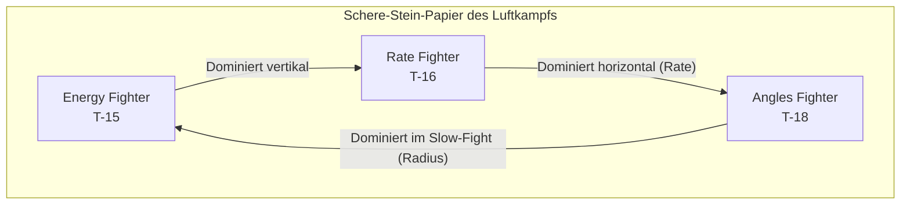

# VFM Flight Academy

> Taktische Doktrin für Virtual Fighter Maneuvers

Willkommen in der **Flight Academy**. Dieses Wiki dient als umfassendes Handbuch für Luftkampf-Taktiken in **Virtual Fighter Maneuvers** (VFM).

Es ist in drei Hauptbereiche unterteilt:
1. **Grundlagen**: Universelle Konzepte und Theorie für jeden Piloten.
2. **Flugzeug-Daten**: Leistungsdaten und Charakteristiken der drei Muster.
3. **Taktiken**: Spezifische Kampfanleitungen für jedes Flugzeug gegen jeden Gegner.

::: info KONTEXT
VFM von Boundless Dynamics simuliert komplexe Aerodynamik: Transsonischer Widerstand, Anstellwinkel (AoA) und spezifische Energiezustände sind modelliert. Wir wenden hier echte BFM-Prinzipien (Basic Fighter Maneuvers) an.
:::

## Schnellstart

Für neue Piloten ist dies der empfohlene Pfad:

1. **Grundlagen**: Lerne die [Golden Rules](/grundlagen/golden-rules) – die 10 universellen Gebote des Luftkampfs.
2. **Theorie**: Verstehe die [Kampf-Geometrie](/grundlagen/geometrie) (One-Circle vs. Two-Circle).
3. **Dein Flugzeug**: Wähle dein Muster und studiere die Leistungsdaten.
4. **Taktiken**: Lerne die spezifischen Taktiken gegen jeden Gegnertyp.

---

## Die Flugzeug-Typen (Archetypen)

Im Luftkampf gibt es drei fundamentale Design-Philosophien. Jedes Flugzeug in VFM verkörpert eines dieser Extreme.

| Archetyp | VFM Muster | Stärke | Schwäche |
|---|---|---|---|
| **Energy Fighter** | **[T-15 Excalibur](/flugzeuge/t15-excalibur)** | Schub, Vertikale, Speed | Wenderadius |
| **Rate Fighter** | **[T-16 Falchion](/flugzeuge/t16-falchion)** | Beste Wenderate (Sustained) | Vertikale Ausdauer |
| **Angles Fighter** | **[T-18 Cutlass](/flugzeuge/t18-cutlass)** | Bester Radius (Instantaneous) | Energie-Erhalt |

---

## Modul-Übersicht

### Grundlagen (Theorie)
Die theoretische Basis für alle Piloten - flugzeugneutral.

- **[Golden Rules](/grundlagen/golden-rules)**: Die 10 Gebote des Luftkampfs
- **[Kampf-Geometrie](/grundlagen/geometrie)**: One-Circle vs Two-Circle
- **[Energie-Management](/grundlagen/energie-management)**: Corner Speed & Unloading
- **[Verfolgungskurven](/grundlagen/verfolgungskurven)**: Lead, Lag und Pure Pursuit
- **[Offensiv-Manöver](/grundlagen/offensiv-manoever)**: High/Low Yo-Yo, Barrel Roll Attack
- **[Defensiv-Manöver](/grundlagen/defensiv-manoever)**: Scissors, Break Turn, Overshoot
- **[Vertikal-Manöver](/grundlagen/vertikal-manoever)**: Taktische Spirale

### Flugzeug-Daten
Leistungsdaten, Stärken und Schwächen - ohne Taktiken.

- **[T-15 Excalibur](/flugzeuge/t15-excalibur)**: Energy Fighter
- **[T-16 Falchion](/flugzeuge/t16-falchion)**: Rate Fighter
- **[T-18 Cutlass](/flugzeuge/t18-cutlass)**: Angles Fighter

### Taktiken

#### T-15 Excalibur Pilot
- **[vs T-16 Falchion](/taktiken/t15/vs-t16)**: Energy vs Rate
- **[vs T-18 Cutlass](/taktiken/t15/vs-t18)**: Energy vs Radius
- **[vs T-15 (Spiegel)](/taktiken/t15/vs-t15)**: Energy vs Energy

#### T-16 Falchion Pilot
- **[vs T-15 Excalibur](/taktiken/t16/vs-t15)**: Rate vs Energy
- **[vs T-18 Cutlass](/taktiken/t16/vs-t18)**: Rate vs Radius
- **[vs T-16 (Spiegel)](/taktiken/t16/vs-t16)**: Rate vs Rate

#### T-18 Cutlass Pilot
- **[vs T-15 Excalibur](/taktiken/t18/vs-t15)**: Radius vs Energy
- **[vs T-16 Falchion](/taktiken/t18/vs-t16)**: Radius vs Rate
- **[vs T-18 (Spiegel)](/taktiken/t18/vs-t18)**: Radius vs Radius

---

## Philosophie

Der Schlüssel zum Sieg liegt nicht im engeren Ziehen, sondern im **Verständnis der Physik**. Ein guter Pilot kennt nicht nur sein eigenes Flugzeug, sondern auch das seines Gegners genau. Er zwingt dem Gegner den Kampf auf, den dieser nicht gewinnen kann.

**[Starte mit den Golden Rules](/grundlagen/golden-rules)**
