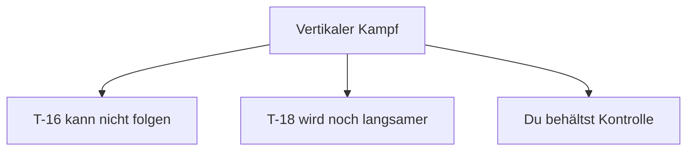
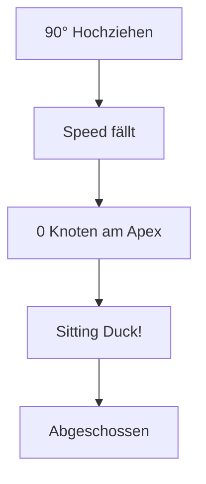
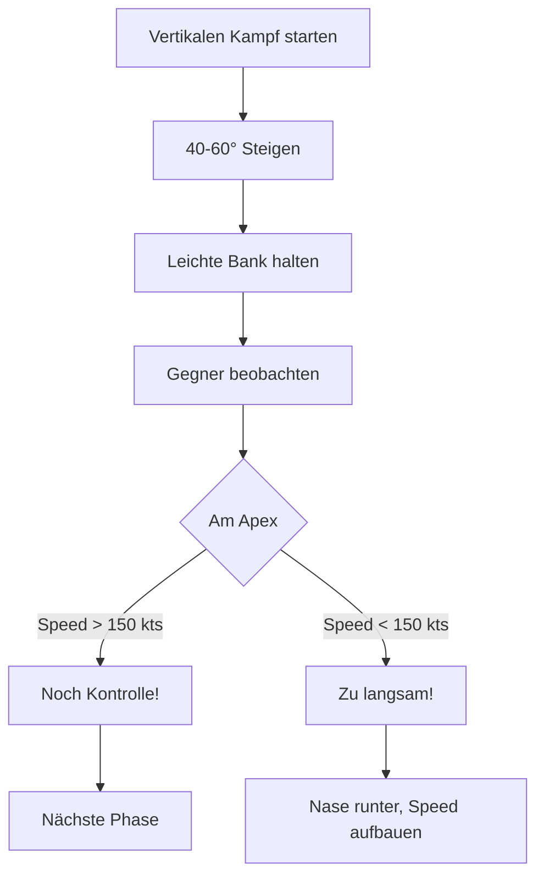
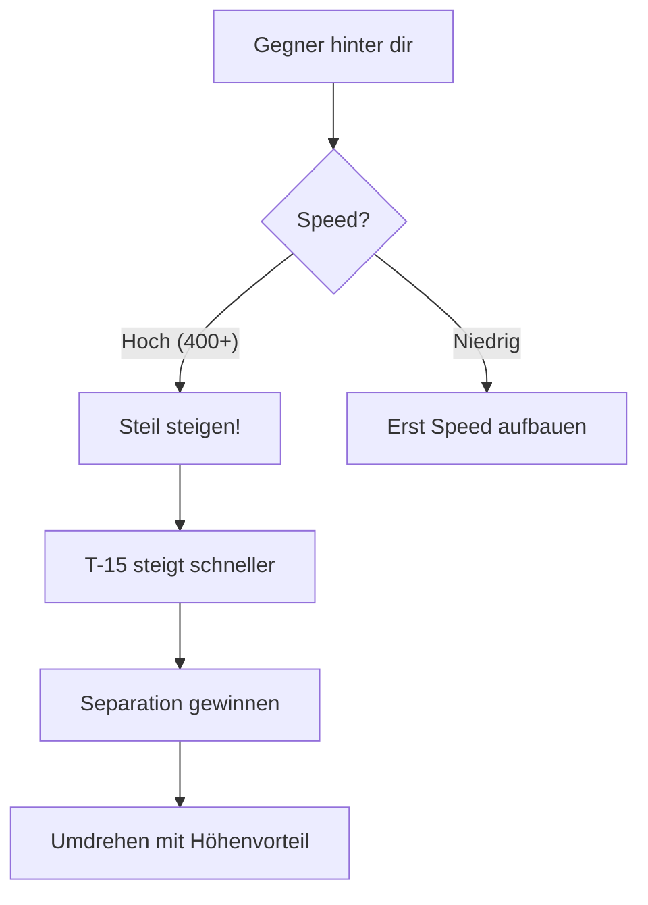
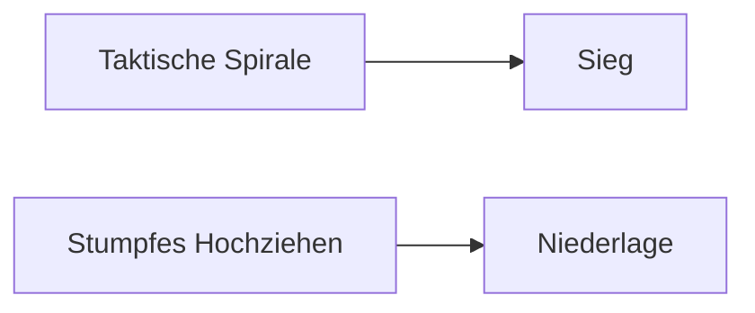

# Vertikaler Kampf

Die Vertikale ist das Heimatgebiet der T-15 Excalibur. Hier gewinnst du Kämpfe, die horizontal verloren wären.

## Warum Vertikal?

Die T-15 hat:
- **Bestes Schub/Gewicht-Verhältnis**
- **Schnellste Energie-Erholung**
- **Vertikale Überlegenheit** über alle anderen



---

## Der kritische Fehler: Pure Vertical

::: danger FEHLER: Stumpfes Hochziehen
Einfach 90° hochziehen ist **tödlich**!

**Was passiert:**
- Bei 0 Knoten hast du **keine Kontrolle**
- Du bist ein **stationäres Ziel**
- Gegner (besonders T-16) schießt dich ab
:::

### Das Problem visualisiert



---

## Die Lösung: Die Taktische Spirale ("The Egg")

Statt gerade hoch zu fliegen, fliege ein "Ei" - eine spiralförmige Steigkurve.

### Das Konzept

```
        ___
       /   \     ← Apex (aber mit Speed!)
      |     |
       \   /     ← Du siehst den Gegner
        | |
        |_|      ← Start
```

### Ausführung

1. **Steigwinkel: 40-60°** - Nicht 90°!
2. **Leichte Querneigung** (Bank) beibehalten
3. **Rollrichtung** - So dass du den Gegner siehst
4. **Speed-Minimum: 150-180 kts** am Apex



---

## Vorteile der Taktischen Spirale

| Aspekt | Pure Vertical | Taktische Spirale |
|--------|---------------|-------------------|
| Sicht auf Gegner | Verloren | Behalten |
| Speed am Apex | ~0 kts | 150+ kts |
| Kontrolle | Keine | Ja |
| Reaktionsfähigkeit | Null | Gut |

---

## Vertikale Taktiken

### Zoom Climb

Nutze überschüssige Energie für schnellen Höhengewinn.

1. Bei hoher Speed (450+ kts) hochziehen
2. Steile Steigung (60-70°)
3. Vor Speed-Verlust abflachen
4. Höhenvorteil gewonnen

::: tip WANN NUTZEN
- Nach High-Speed-Pass
- Gegner ist tiefer und langsamer
- Du willst Separation
:::

### Yo-Yo mit Vertikaler Komponente

Kombiniere High Yo-Yo mit mehr Höhengewinn:

1. Statt 30° hochziehen, gehe auf 50°
2. Rolle über den Gegner
3. Du bist jetzt **über** ihm mit Energie-Vorteil

---

## Vertikale Defensive

Wenn du in der Defensive bist, nutze die Vertikale:

### Das "High-Speed Climb Out"



**Warum es funktioniert:**
- T-15 hat bestes Schub/Gewicht
- T-16 verliert in der Vertikalen
- T-18 kann gar nicht steigen

---

## Minimum Speed Regeln

| Situation | Minimum Speed |
|-----------|---------------|
| Apex der Spirale | 150-180 kts |
| Vertikaler Turn | 200 kts |
| Generell | Nie unter 150 kts |

::: warning UNTER 150 KNOTEN
Unter 150 kts verliert die T-15 die Kontrollfähigkeit. Du kannst nicht mehr effektiv manövrieren!
:::

---

## Zusammenfassung

### DO's (Machen!)

- Taktische Spirale statt stumpf hochziehen
- Speed am Apex behalten (150+ kts)
- Gegner im Auge behalten
- Vertikale gegen T-16 und T-18 nutzen

### DON'TS (Vermeiden!)

- 90° Pure Vertical
- 0 kts am Apex
- Sicht auf Gegner verlieren
- Panisches Hochziehen ohne Plan



::: info MERKE
Die Vertikale ist dein Freund - aber nur mit der richtigen Technik. Spirale > Pure Vertical!
:::
