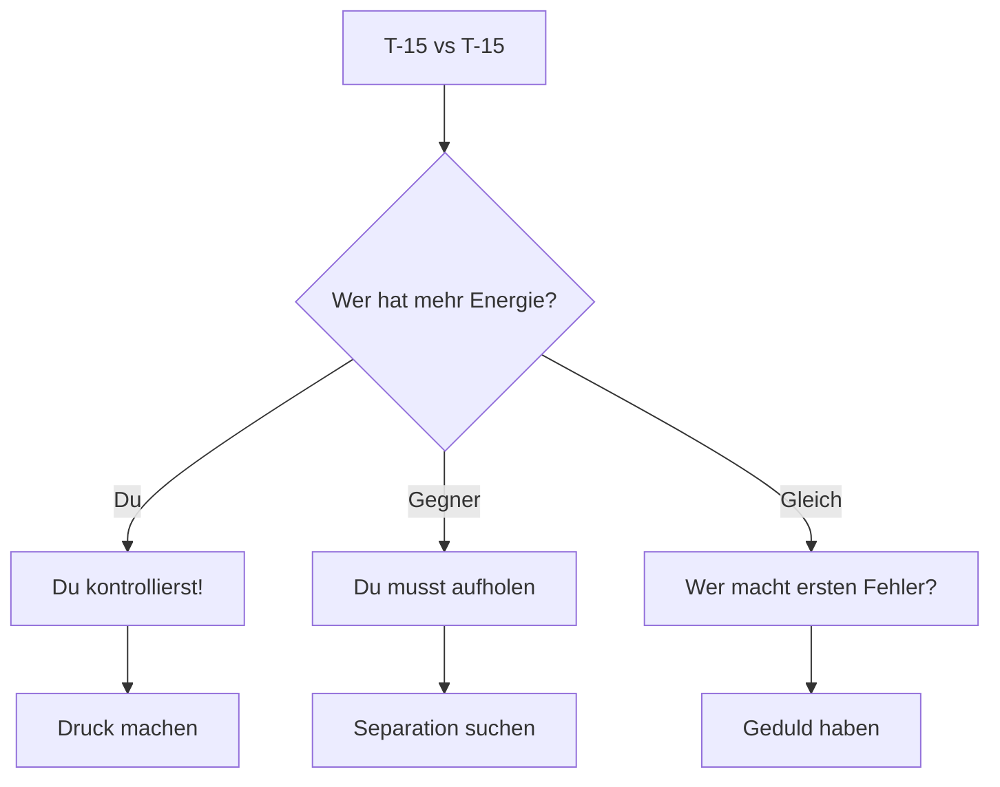
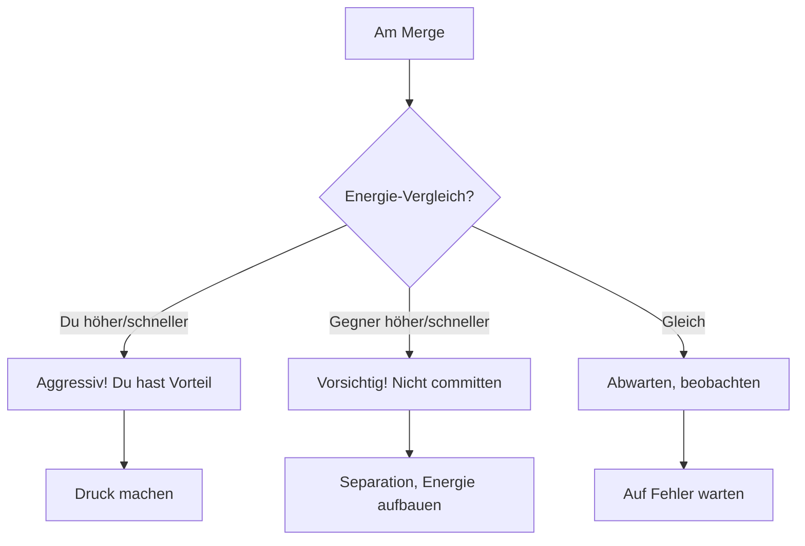
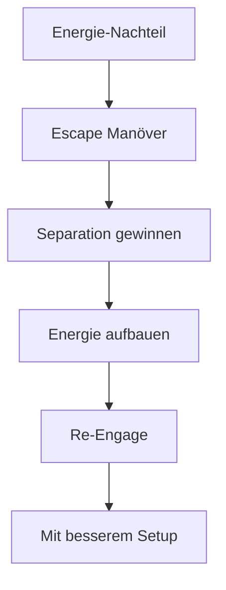
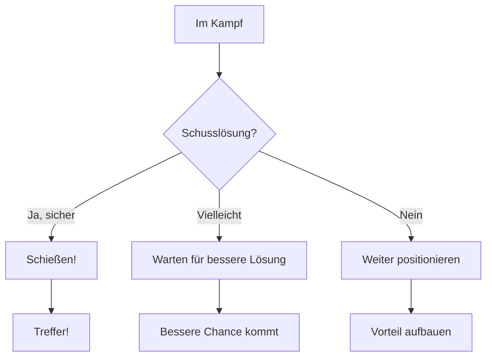
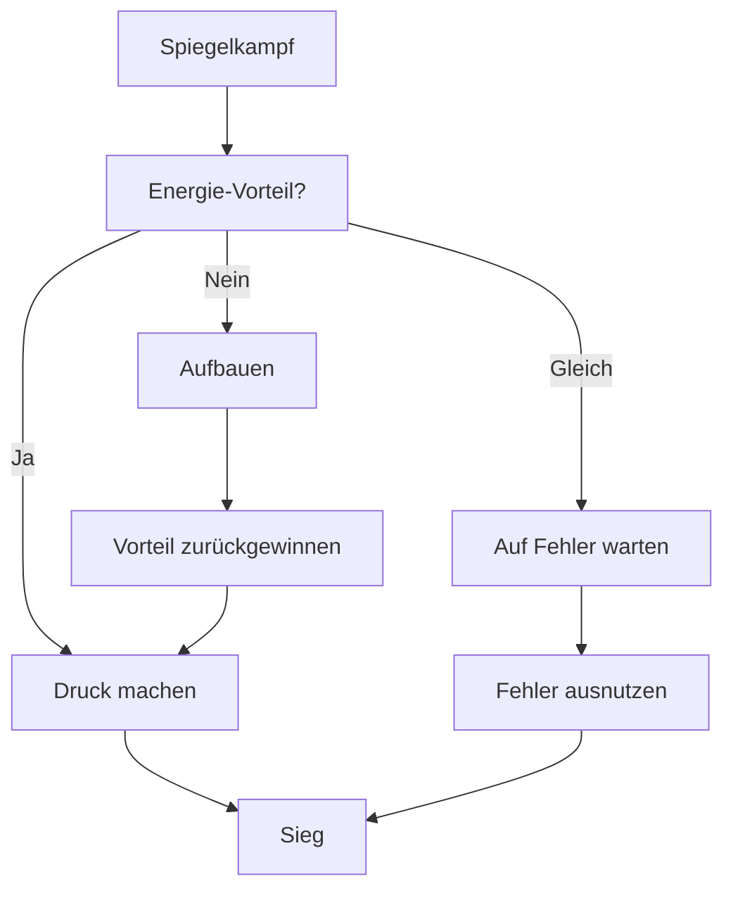

# T-15 vs T-15

> Der Spiegelkampf - Wer macht weniger Fehler?

## Gegner-Profil

| Eigenschaft | T-15 Excalibur |
|-------------|----------------|
| **Typ** | Energy Fighter |
| **Stärke** | Vertikale Dominanz, Energie-Management |
| **Schwäche** | Großer Radius |
| **Corner Speed** | ~425 kts |
| **Besonderheit** | Identisch mit deinem Flugzeug |

::: info SPIEGELKAMPF
Beide Flugzeuge sind identisch. Es gibt keinen inherenten Vorteil. **Derjenige gewinnt, der weniger Fehler macht.**
:::

---

## Die Strategie

### Das Kern-Prinzip

> **Energie-Vorteil ist alles. Wer mehr Energie hat, kontrolliert den Kampf.**

---

## Phase 1: Der Merge

### Keine klare Antwort

Anders als gegen T-16 oder T-18 gibt es hier keine "richtige" Flow-Wahl:

| Flow | Ergebnis |
|------|----------|
| Two-Circle | ~50/50 - gleiche Rate |
| One-Circle | ~50/50 - gleicher Radius |
| Vertikal | ~50/50 - gleicher Schub |

### Was zählt

1. **Eintritts-Energie** - Wer hat mehr Speed/Höhe?
2. **Timing** - Wer committed zuerst?
3. **Fehler** - Wer macht den ersten Fehler?

---

## Energie-Vorteil aufbauen

### Wenn du Vorteil hast

Nutze ihn sofort, aber verschwende ihn nicht:

1. **Druck machen** - Zwinge Gegner zu reagieren
2. **Nicht übercommiten** - Behalte Energie-Reserve
3. **Schusslösung suchen** - Aber keine verzweifelten Schüsse

### Wenn du Nachteil hast

Überlebe und baue auf:

1. **Separation** - Raus aus dem Fight
2. **Unload + Afterburner** - Energie aufbauen
3. **Reset** - Neu engagen mit besserem Setup

---

## Die Vertikale

Auch im Spiegelkampf ist die Vertikale wichtig:

### Höhenvorteil

Wer höher ist, hat:
- Mehr potenzielle Energie
- Option für Angriff von oben
- Bessere Übersicht

### Taktische Spirale

Beide können sie fliegen - wer macht sie besser?

::: tip TIPP
Beobachte den Gegner genau:
- Macht er Fehler in der Spirale?
- Wird er zu langsam am Apex?
- Verliert er dich aus den Augen?
:::

---

## Typische Fehler ausnutzen

### Fehler, auf die du wartest

| Gegner-Fehler | Deine Reaktion |
|---------------|----------------|
| Zu langsam in Turn | Energie-Vorteil nutzen |
| Zu schnell am Merge | Overshoot erzwingen |
| Zu aggressiv | Defensive, dann kontern |
| Schlechte Spirale | Höhenvorteil sichern |
| Verliert dich aus Sicht | Repositionieren |

### Fehler, die du vermeiden musst

- Unnötige Turns (Energie-Verschwendung)
- Zu langsam werden
- Gegner aus den Augen verlieren
- Überhastete Schüsse
- Panik

---

## Schusslösung

### Geduld ist Trumpf

Im Spiegelkampf ist es schwer, eine Schusslösung zu bekommen. Beide sind gleich gut.

### Gun vs Missile

- **Gun:** Nur bei sicherer Lösung, kurze Bursts
- **Fox 2:** Bei Separation + stabiler Verfolgung
- **Verschwendung vermeiden:** Schlechte Schüsse = verschwendete Gelegenheit

---

## Psychologie

Der Spiegelkampf ist auch ein mentaler Kampf:

### Bleib ruhig

- Stress führt zu Fehlern
- Ungeduld führt zu Übercommitment
- Panik führt zu Energie-Verschwendung

### Beobachte den Gegner

- Zeigt er Ungeduld?
- Macht er hektische Bewegungen?
- Werden seine Manöver sloppier?

::: info MENTALITÄT
Der Spiegelkampf ist ein Geduldsspiel. Wer zuerst die Nerven verliert, verliert den Kampf.
:::

---

## Zusammenfassung

### Kern-Regeln

1. **Energie ist alles** - Immer Energie-Status beobachten
2. **Geduld** - Nicht zum Fehler zwingen lassen
3. **Fehler ausnutzen** - Auf Gegner-Fehler warten
4. **Eigene Fehler vermeiden** - Disziplin halten

::: tip MERKE
Im Spiegelkampf gibt es keinen technischen Vorteil. Gewinne durch bessere Entscheidungen, mehr Geduld und weniger Fehler.
:::
