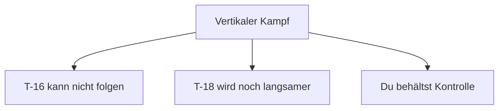
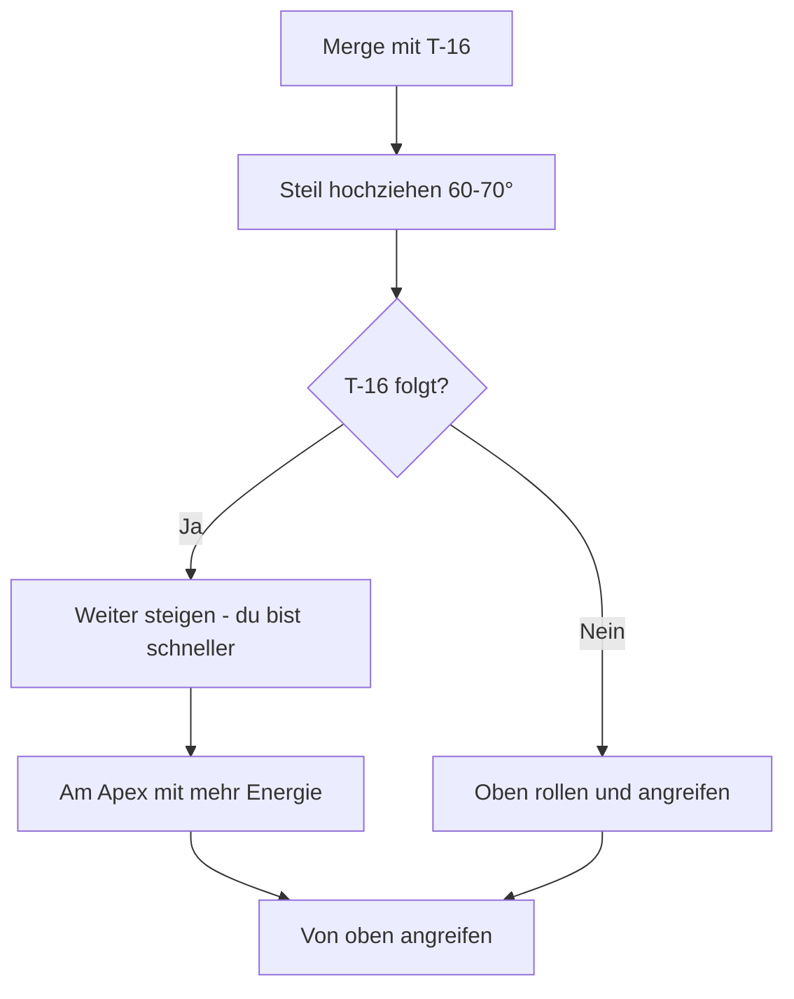
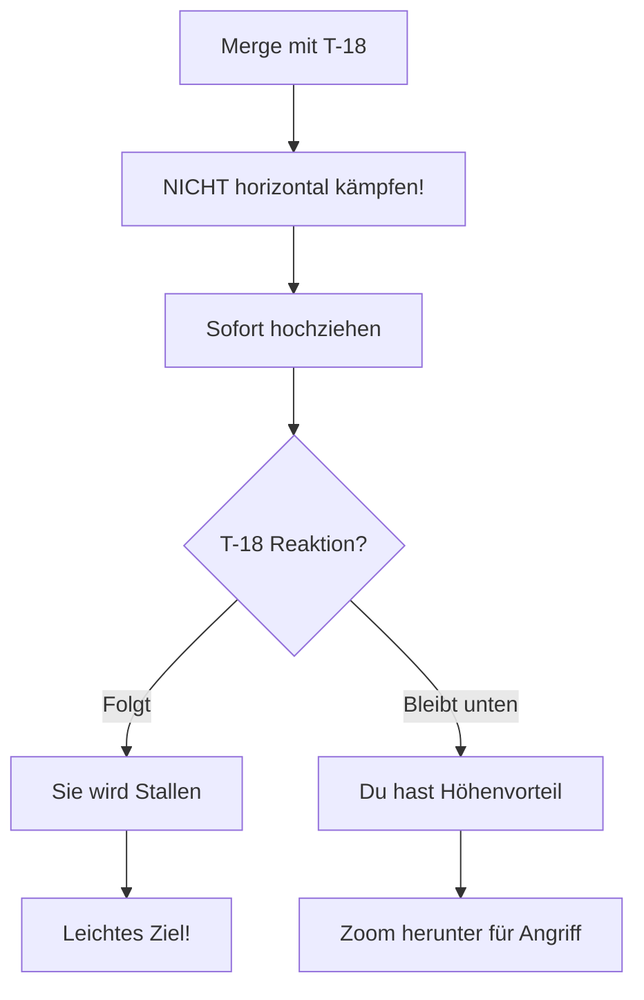
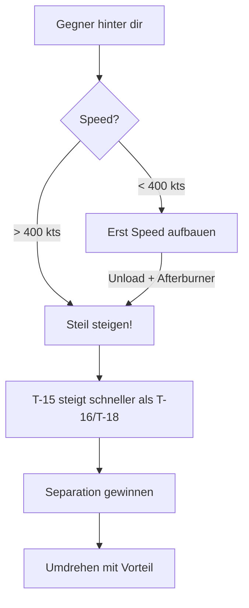

# T-15: Vertikale Dominanz

Die Vertikale ist das Heimatgebiet der T-15 Excalibur. Hier gewinnst du Kämpfe, die horizontal verloren wären.

## Warum die T-15 vertikal dominiert

Die T-15 hat entscheidende Vorteile in der Vertikalen:

| Parameter | T-15 | T-16 | T-18 |
|-----------|------|------|------|
| Triebwerke | **2** | 1 | 2 (schwächer) |
| TWR | **Beste** | Mittel | Schwächste |
| Steigrate | **Höchste** | Mittel | Niedrig |

---

## Taktik vs T-16 Falchion

Die T-16 hat nur ein Triebwerk und kann dir vertikal nicht folgen.

### Das Konzept

1. **Zwinge sie in die Vertikale** - Steige nach dem Merge
2. **T-16 verliert Energie** - Gegen Schwerkraft ist sie ineffizient
3. **Du behältst Energie** - Dein TWR ist überlegen
4. **Von oben angreifen** - Rolle zurück und greife von oben an

### Ausführung

::: tip TIMING
Beginne den Vertikalen bei **450+ kts**. Du brauchst genug Energie um höher zu steigen als die T-16.
:::

---

## Taktik vs T-18 Cutlass

Die T-18 hat das schlechteste TWR und kann absolut nicht steigen.

### Das Konzept

1. **Sofort vertikal** - Die T-18 WILL horizontal kämpfen
2. **Niemals One-Circle** - Dort ist sie gefährlich
3. **Zwinge sie nach oben** - Sie wird rapide Energie verlieren
4. **Warte auf Stall** - Bei hohem AoA vertikal fällt sie wie ein Stein

### Ausführung

::: danger WARNUNG
Wenn die T-18 es schafft, dich in einen langsamen One-Circle zu zwingen (unter 300 kts), hast du verloren. **Bleib schnell, bleib vertikal!**
:::

---

## High-Speed Climb Out (Defensive)

Wenn eine T-16 oder T-18 hinter dir sitzt:

### Voraussetzung

Du brauchst mindestens **400 kts** um effektiv zu steigen.

### Ausführung

1. **Vollgas (Afterburner)**
2. **Steil hochziehen** (60-70°)
3. **Nicht in ihre Richtung drehen** - Geradeaus steigen
4. **Separation gewinnen**
5. **Oben umdrehen** mit Höhen- und Energievorteil

### Warum es funktioniert

- **Gegen T-16**: Sie hat nur ein Triebwerk, verliert rapide Energie beim Steigen
- **Gegen T-18**: Sie kann kaum steigen, wird aufgeben oder Stallen

---

## T-15 vs T-15 (Spiegel)

Im vertikalen Kampf gegen eine andere T-15 entscheidet:

1. **Energie am Merge** - Wer mehr hat, gewinnt oben
2. **Technik** - Taktische Spirale vs Pure Vertical
3. **Geduld** - Wer zuerst Energie verschwendet, verliert

::: tip SPIEGEL-TAKTIK
Wenn beide gleich viel Energie haben, warte auf einen Fehler. Der erste, der zu aggressiv zieht und Energie verliert, wird zum Ziel.
:::

---

## Minimum Speed Regeln für T-15

| Situation | Minimum Speed |
|-----------|---------------|
| Vertikaler Apex | 150-180 kts |
| Vertikaler Turn | 200 kts |
| Kampf generell | 300+ kts bevorzugt |

::: warning UNTER 300 KTS
Die T-15 verliert unter 300 kts ihre Vorteile. Hier werden T-16 und T-18 gefährlich. **Werde niemals freiwillig langsam!**
:::

---

## Zusammenfassung

| Gegner | Vertikale Taktik | Begründung |
|--------|------------------|------------|
| T-16 | Hochsteigen, von oben angreifen | Ein Triebwerk kann nicht folgen |
| T-18 | Sofort vertikal, niemals One-Circle | Schlechtestes TWR, will horizontal |
| T-15 | Energie-Management, Geduld | Gleiche Fähigkeiten |

::: info T-15 PHILOSOPHIE
**Die Vertikale ist dein Freund.** Wenn du horizontal kämpfst, spielst du das Spiel der T-16 (Rate) oder T-18 (Radius). In der Vertikalen spielen alle **dein** Spiel.
:::
