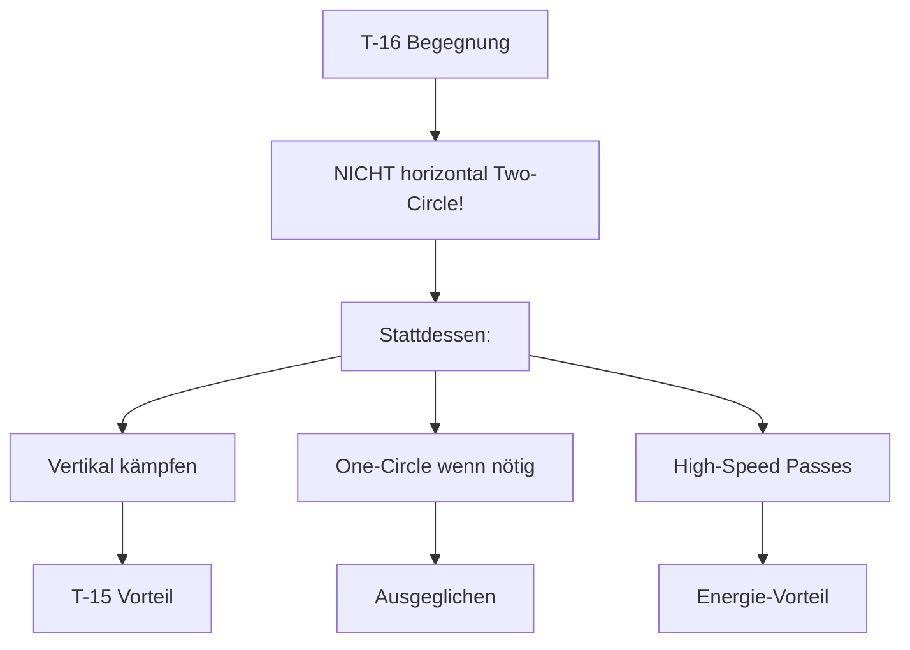
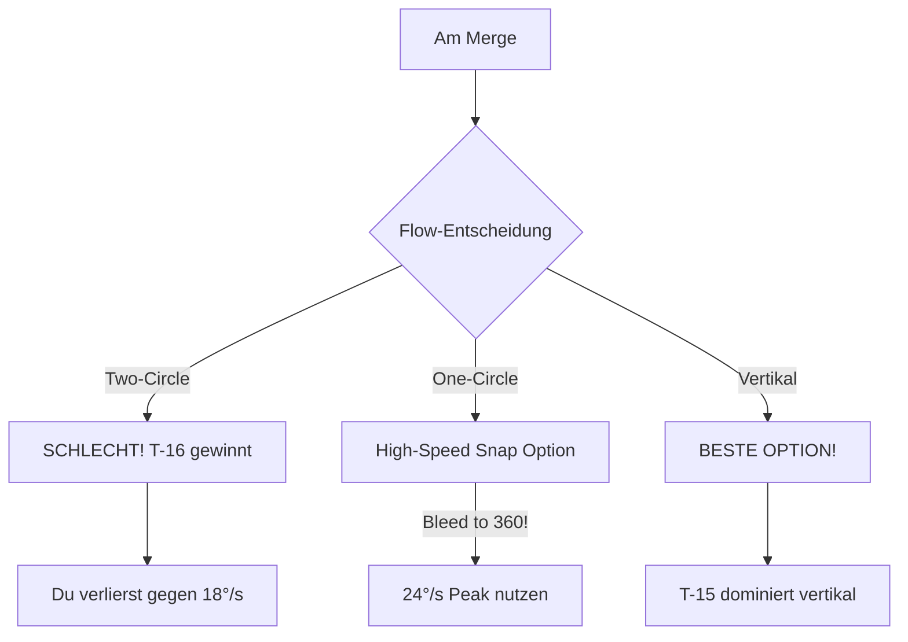
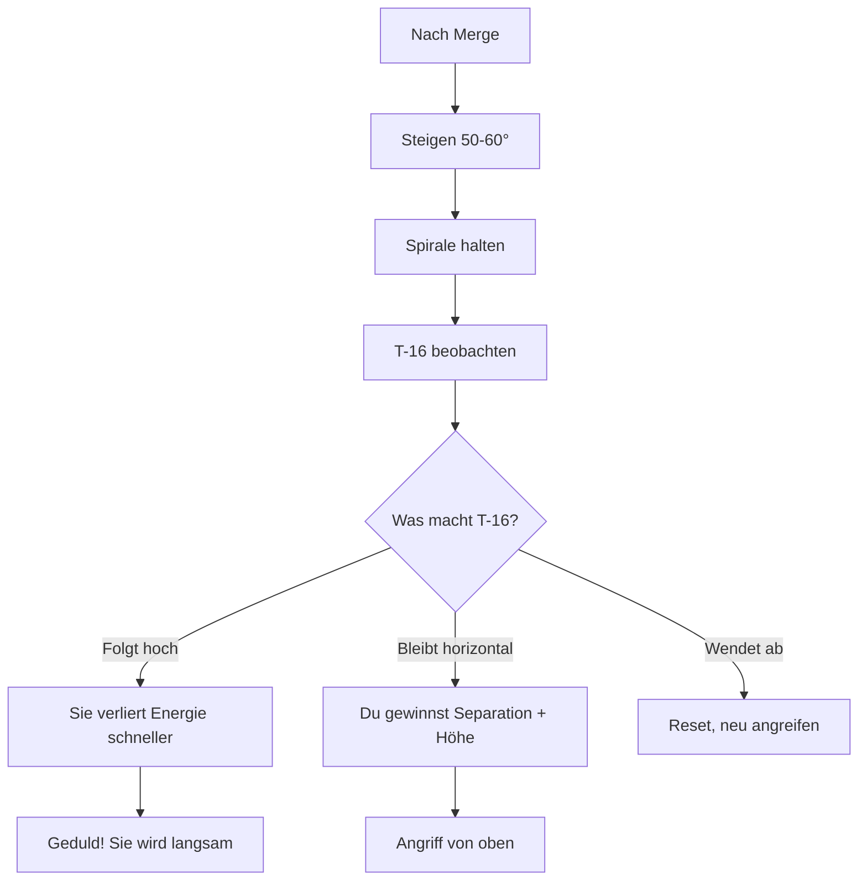
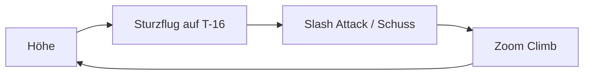
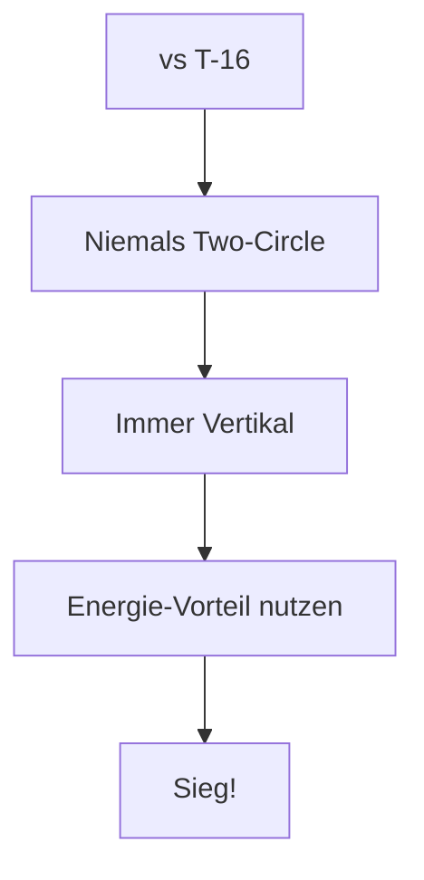

# T-15 vs T-16 Falchion

> Anti-Rate-Fight Taktik

## Gegner-Profil

| Eigenschaft | T-16 Falchion |
|-------------|---------------|
| **Typ** | Rate Fighter |
| **Stärke** | Beste horizontale Turn Rate |
| **Schwäche** | Vertikale Performance |
| **Corner Speed** | ~409 kts |
| **Gefährlichkeit** | Hoch |

::: danger WARNUNG
Die T-16 ist dein gefährlichster Gegner im horizontalen Kampf. Sie wird jeden Two-Circle-Fight gewinnen!
:::

---

## Die Strategie

### Das Kern-Prinzip

> **Vermeide den horizontalen Kampf. Geh vertikal.**

---

## Phase 1: Der Merge

### Was die T-16 will

- Horizontalen Two-Circle-Fight erzwingen
- Dich in ihre **Kill Zone (350-500 kts)** ziehen
- Ihre überlegene Sustained Rate (18°/s) nutzen

### Deine Antwort

**Empfehlung am Merge:**
1. **Option A (Standard):** Geh sofort vertikal. Sicherste Variante.
2. **Option B (Aggressiv):** Fliege schnell an (450+), ziehe hart One-Circle und lass die Speed auf **360 kts fallen**. Dort hast du kurzzeitig 24°/s. Wenn der Schuss nicht sitzt: **Sofort Unload und weg!**

---

## Phase 2: Vertikaler Kampf

### Warum Vertikal funktioniert

| Aspekt | T-15 | T-16 |
|--------|------|------|
| Schub/Gewicht | Exzellent | Gut |
| Vertikale Turn | Stark | Schwächer |
| Energie-Erholung | Schnell | Langsamer |

### Die taktische Spirale gegen T-16

---

## Phase 3: Der Angriff - Boom and Zoom

### Die komplette Strategie

1. **Merge**: Gehe mit hoher Geschwindigkeit (**Mach 0.9+**) in den Merge
2. **Erster Zug**: Wenn die T-16 horizontal dreht, ziehe sofort **vertikal** (Oblique Loop)
3. **Die Falle**: Die T-16 wird versuchen, die Nase hochzuziehen, um dich zu bekommen. Da sie aber gleichzeitig eng kurvt, **blutet sie massive Energie**
4. **Der Schlag**: Du, in der reinen Vertikale mit **zwei Triebwerken**, steigst höher. Wenn die T-16 unter dir langsam wird/stallt:
   - Kippe über den Flügel (**Hammerhead/Stall Turn**)
   - Stürze auf sie herab
   - Feuere und ziehe sofort wieder hoch (**Zoom Climb**)
5. **Disziplin**: Lass dich **nicht** auf einen Kurvenkampf ein. Hacke auf sie ein ("**Slash Attacks**")

### Schusslösung

- **Gun:** Nur bei sicherer Lösung (kurze Bursts im Vorbeiflug)
- **Fox 2:** Bei stabiler Verfolgung von oben
- **Geduld:** Besser keine Schüsse als schlechte Schüsse
- **Nicht committen:** Nach dem Schuss sofort wieder hoch!

---

## Defensive gegen T-16

Wenn die T-16 hinter dir ist:

::: danger SOFORTMASSNAHMEN
1. **Afterburner** aktivieren
2. **Steigen!** - Die T-16 kann nicht so gut folgen
3. **Taktische Spirale** - Behalte sie im Auge
4. Warte bis du oben bist, dann umdrehen
:::

### Was NICHT tun

- Horizontal drehen → T-16 gewinnt
- Break Turn und bleiben → T-16 holt auf
- Panisch werden → Fehler machen

---

## Zusammenfassung

### DO's (Machen!)

- Vertikal kämpfen
- High-Speed Passes
- Energie-Vorteil aufbauen
- Geduld haben

### DON'TS (Vermeiden!)

- Horizontaler Two-Circle
- Sustained Turn gegen T-16
- Langsam werden
- Im Rate-Fight bleiben

::: info MERKE
Die T-16 ist horizontal überlegen. Aber du bist vertikal überlegen. Kämpfe auf deinem Terrain!
:::
