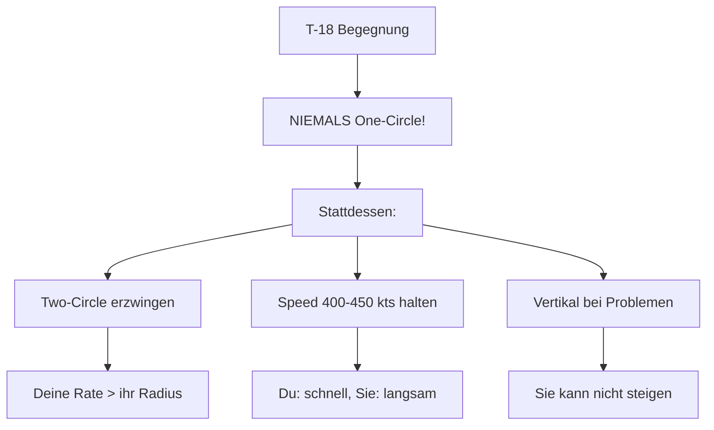
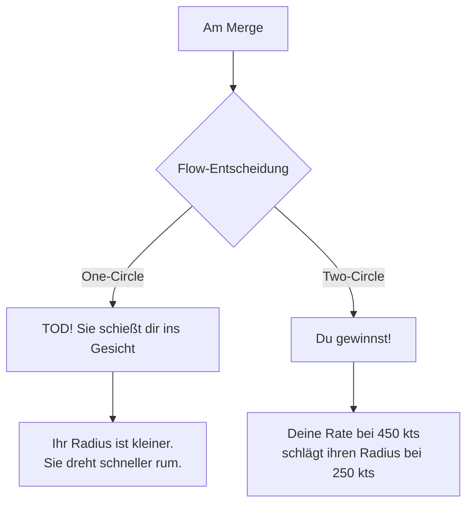
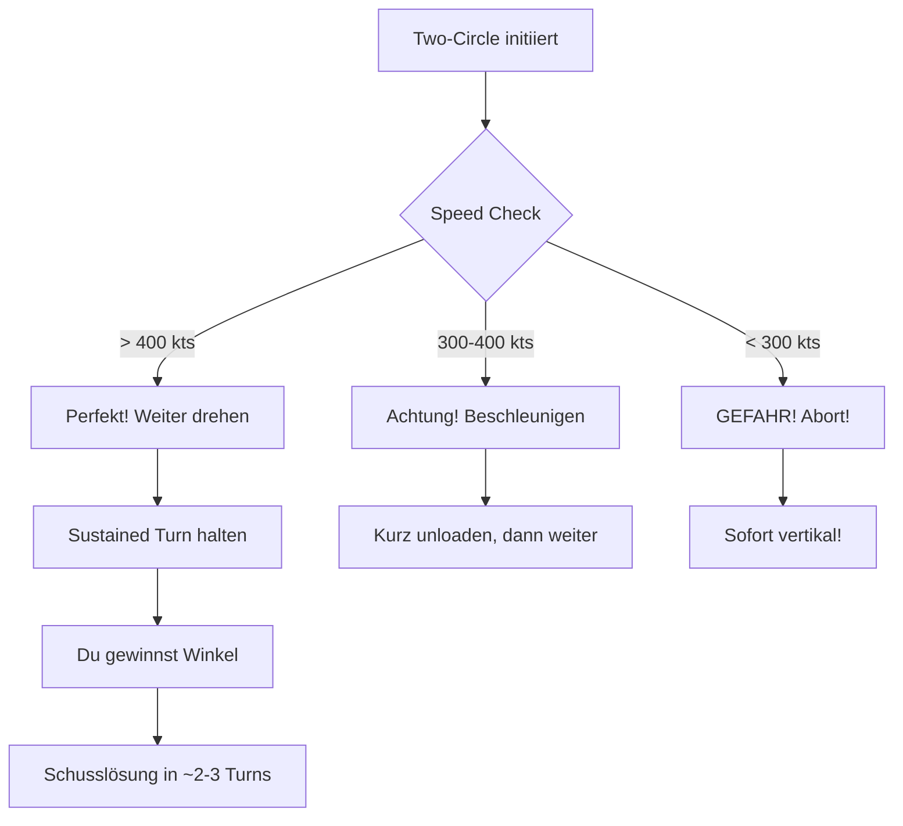
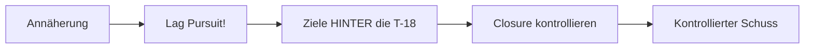
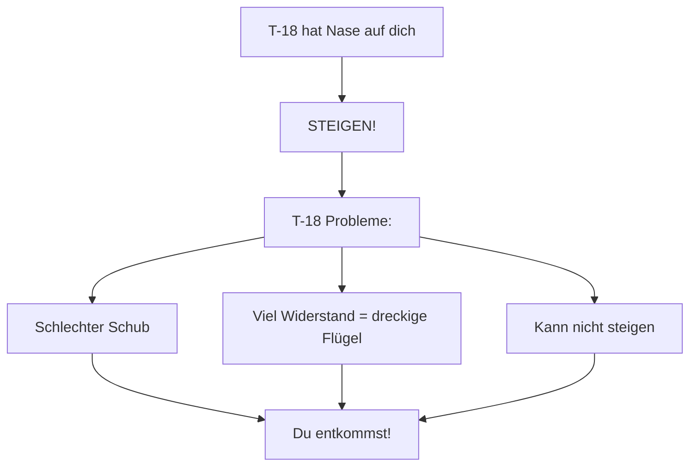
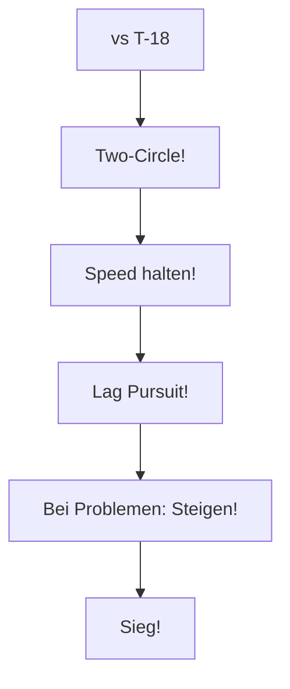

# T-15 vs T-18 Cutlass

> Anti-Radius-Fight Taktik

## Gegner-Profil

| Eigenschaft | T-18 Cutlass |
|-------------|--------------|
| **Typ** | Angles/Radius Fighter |
| **Stärke** | Kleinster Turn Radius, schnellste Nase |
| **Schwäche** | Langsam, schlechter Schub, Energie-Bluten |
| **Corner Speed** | ~250-275 kts |
| **Gefährlichkeit** | Extrem hoch in One-Circle! |

::: tip GUTE NACHRICHT
Die T-18 ist der Gegner, den du am **leichtesten** besiegen kannst - wenn du die Regeln befolgst!
:::

---

## Die Strategie

### Das Kern-Prinzip

> **Two-Circle erzwingen. Speed halten. Niemals One-Circle!**

---

## Phase 1: Der Merge

### Was die T-18 will

- One-Circle-Fight (Nase auf Nase)
- Dich langsam machen (< 300 kts)
- In ihren "Angles Bubble" ziehen
- Schneller Snapshot

### Deine Antwort

**Am Merge:**
1. Erkenne die T-18 früh
2. Plane Two-Circle (drehe ZUM Gegner, nicht weg)
3. Halte Speed über 400 kts!

---

## Phase 2: Der Two-Circle-Fight

### Warum Two-Circle funktioniert

Die Mathematik:

| Parameter | T-15 (bei 450 kts) | T-18 (bei 250 kts) |
|-----------|-------------------|-------------------|
| Turn Rate | Hoch | Mittel |
| Turn Radius | Groß | Klein |
| **Winkelgeschwindigkeit** | **Höher!** | Niedriger |

Im Two-Circle zählt **Rate**, nicht Radius. Du drehst schneller um den Kreis als sie.

### Die Ausführung

---

## Phase 3: Schusslösung

### Das Problem: Overshoot

Die T-18 wird im Turn **extrem langsam** (250 kts). Du kommst mit 450 kts an.

::: warning OVERSHOOT-GEFAHR
Wenn du in Lead Pursuit anfliegst, wirst du **garantiert** overshooten!
:::

### Die Lösung: Lag Pursuit

**Schritt für Schritt:**
1. Bleibe in **Lag Pursuit** (hinter sie zielen)
2. Reduziere Closure Rate
3. Wechsle zu **Pure/Lead** nur für den Schuss
4. Sofort zurück zu Lag nach Schuss

---

## Notfall: T-18 hat Nase auf dich

Wenn die T-18 die Nase auf dich bekommt:

::: danger SOFORTMASSNAHMEN
1. **Vollgas (Afterburner)** - SOFORT!
2. **Steigen!** - Sie kann dir nicht nach oben folgen
3. **Rollen** - Schusslinie brechen
4. Separation aufbauen, dann neu engagen
:::

### Warum Steigen funktioniert

---

## Speed-Management

### Die Speed-Zonen

| Speed | Status | Aktion |
|-------|--------|--------|
| 450+ kts | Optimal | Two-Circle dominieren |
| 400-450 kts | Gut | Weiter kämpfen |
| 300-400 kts | Warnung | Unloaden, Speed aufbauen |
| < 300 kts | Gefahr | SOFORT vertikal! |

### Die goldene Regel

> **Die T-18 bei 250 kts ist ein Monster. Bei 450 kts bist DU das Monster.**

---

## Zusammenfassung

### DO's (Machen!)

- Two-Circle erzwingen
- Speed 400-450 kts halten
- Lag Pursuit bei Annäherung
- Vertikal bei Problemen

### DON'TS (Vermeiden!)

- One-Circle (= Tod)
- Langsam werden (< 300 kts)
- Lead Pursuit (= Overshoot)
- Horizontaler Slow-Speed-Fight

::: info MERKE
Die T-18 ist ein One-Trick-Pony. Verweigere ihr den One-Circle und sie ist hilflos!
:::
