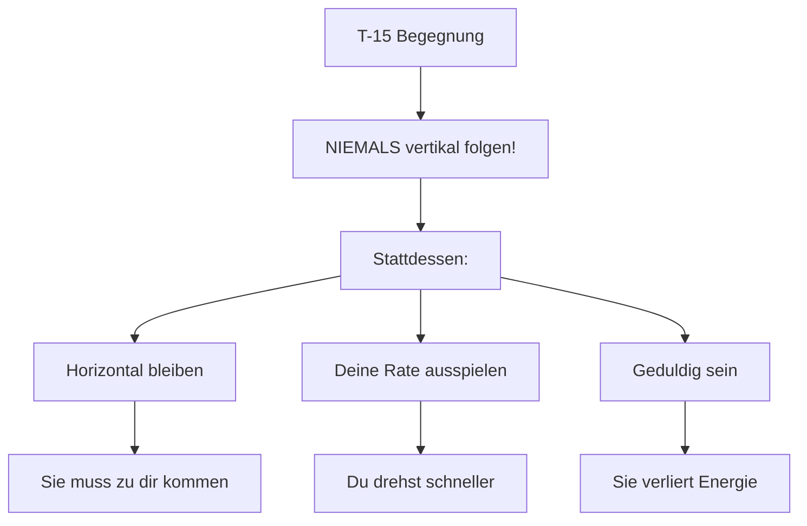
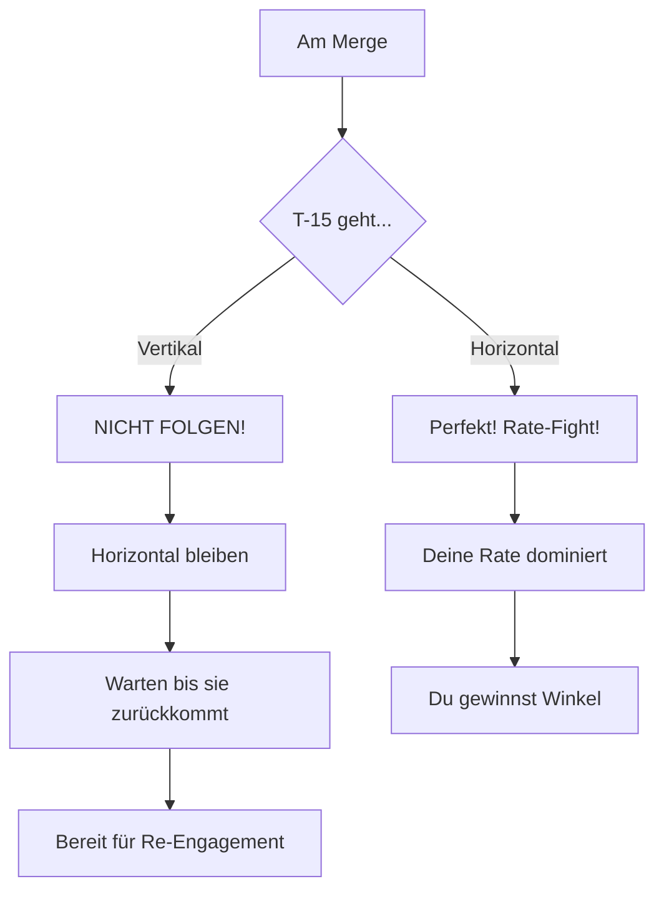
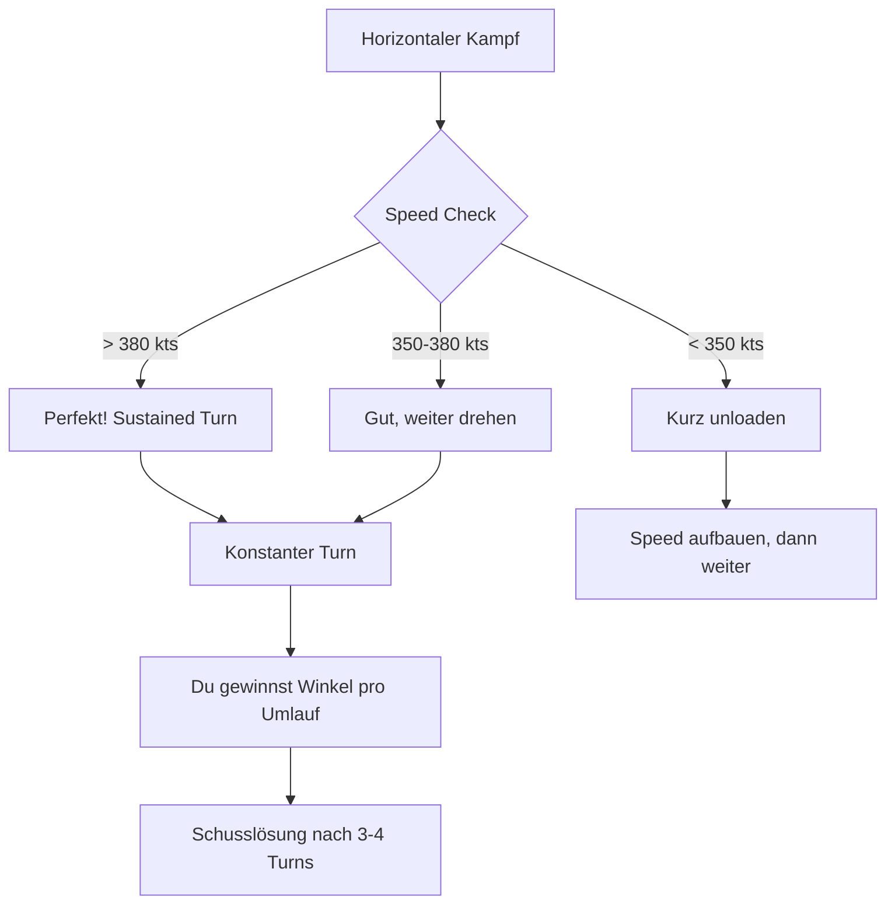
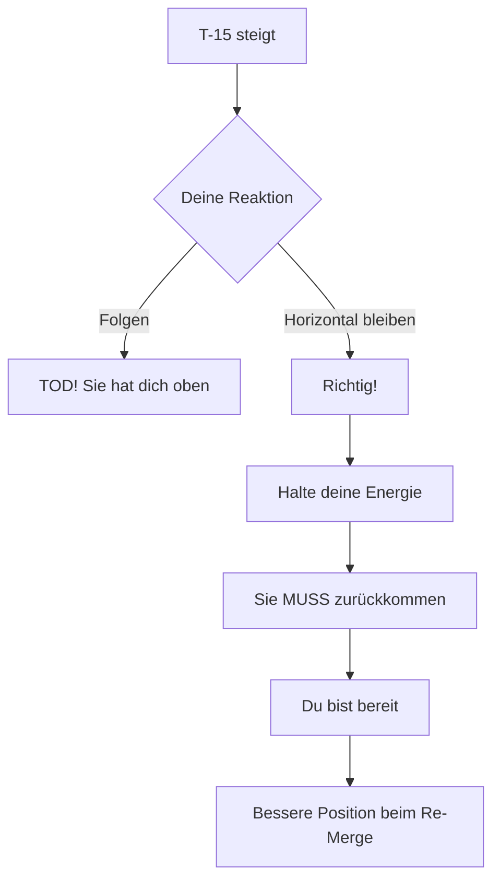
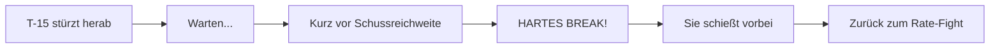
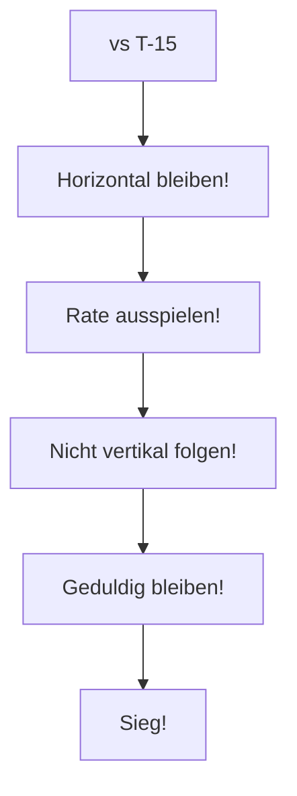

# T-16 vs T-15 Excalibur

> Rate vs Energy - Den Energiekämpfer aushungern

## Gegner-Profil

| Eigenschaft | T-15 Excalibur |
|-------------|----------------|
| **Typ** | Energy Fighter |
| **Stärke** | Beste Beschleunigung, vertikale Dominanz |
| **Schwäche** | Größerer Turn Radius, schwach unter 300 kts |
| **Corner Speed** | 400-450 kts |
| **Gefährlichkeit** | Extrem hoch in der Vertikalen! |

::: warning ACHTUNG
Die T-15 hat **zwei Triebwerke**. Sie kann dich in der Vertikalen immer überholen!
:::

---

## Die Strategie

### Das Kern-Prinzip

> **Horizontal bleiben. Rate ausspielen. Niemals vertikal folgen!**

---

## Phase 1: Der Merge

### Was die T-15 will

- Vertikalen Kampf erzwingen
- Energie aufbauen durch Steigen
- Boom & Zoom Angriffe
- Dich langsam machen

### Deine Antwort

**Am Merge:**
1. Erkenne früh ob die T-15 steigt
2. **Nicht folgen** wenn sie hochzieht
3. Bleibe horizontal, halte deine Energie
4. Warte auf ihre Rückkehr

---

## Phase 2: Der Horizontale Kampf

### Warum Horizontal funktioniert

Die Mathematik:

| Parameter | T-16 (bei 400 kts) | T-15 (bei 400 kts) |
|-----------|-------------------|-------------------|
| Sustained Turn Rate | **Höher!** | Niedriger |
| Energieverlust pro Turn | Gering | Höher |
| Nach 3 Turns | Immer noch 380 kts | Unter 350 kts |

Du hast die **bessere Sustained Turn Rate**. In einem horizontalen Kurvenkampf gewinnst du langsam aber sicher Winkel.

### Die Ausführung

---

## Phase 3: Wenn die T-15 steigt

### Die Falle

Die T-15 wird versuchen, dich in die Vertikale zu locken:

::: danger TODESFALLE
Wenn du der T-15 in den Steigflug folgst:
- Sie hat mehr Schub → steigt schneller
- Du verlierst Energie → wirst langsam
- Sie kommt von oben → Boom & Zoom
- **Du stirbst!**
:::

### Die richtige Antwort

**Wenn die T-15 steigt:**
1. **Nicht folgen!**
2. Horizontal weiterdrehen oder geradeaus
3. Speed bei 400+ kts halten
4. Beobachte wo sie hingeht
5. Bereite dich auf ihren Angriff vor

---

## Phase 4: Der Defensive Turn

Wenn die T-15 von oben angreift (Boom & Zoom):

### Das Timing

**Schritt für Schritt:**
1. Beobachte die angreifende T-15
2. Warte bis sie committed ist (nicht zu früh breaken!)
3. **Hartes Break** in ihre Richtung
4. Sie kann nicht folgen (zu schnell)
5. Sie muss wieder steigen → Du hast Zeit

---

## Speed-Management

### Die Speed-Zonen für T-16

| Speed | Status | Aktion |
|-------|--------|--------|
| 400+ kts | Optimal | Sustained Turn dominieren |
| 350-400 kts | Gut | Weiter kämpfen |
| 300-350 kts | Warnung | Kurz unloaden |
| < 300 kts | Gefahr | Separation aufbauen |

### Die goldene Regel

> **Die T-15 will vertikal. Du willst horizontal. Spiele DEIN Spiel!**

---

## Zusammenfassung

### DO's (Machen!)

- Horizontal bleiben
- Sustained Turn Rate ausspielen
- Geduldig sein (3-4 Turns zum Sieg)
- Speed über 350 kts halten

### DON'TS (Vermeiden!)

- Der T-15 vertikal folgen
- Slow-Speed-Kämpfe (unter 300 kts)
- Ungeduldig werden
- In ihre Stärke spielen

::: info MERKE
Die T-15 ist ein Energie-Monster, aber sie kann dich horizontal nicht schlagen. Verweigere ihr die Vertikale!
:::
