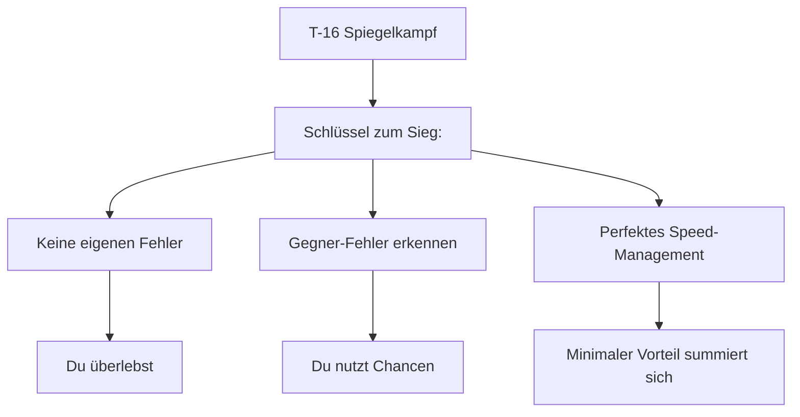
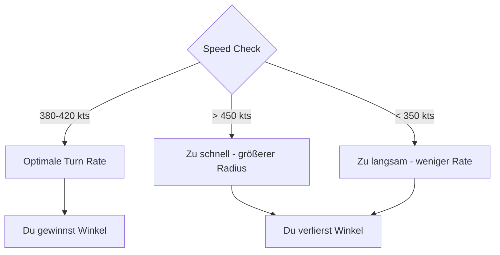
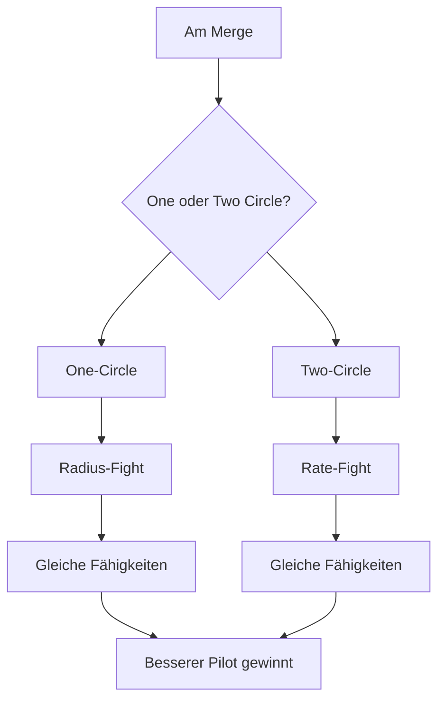
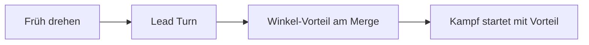
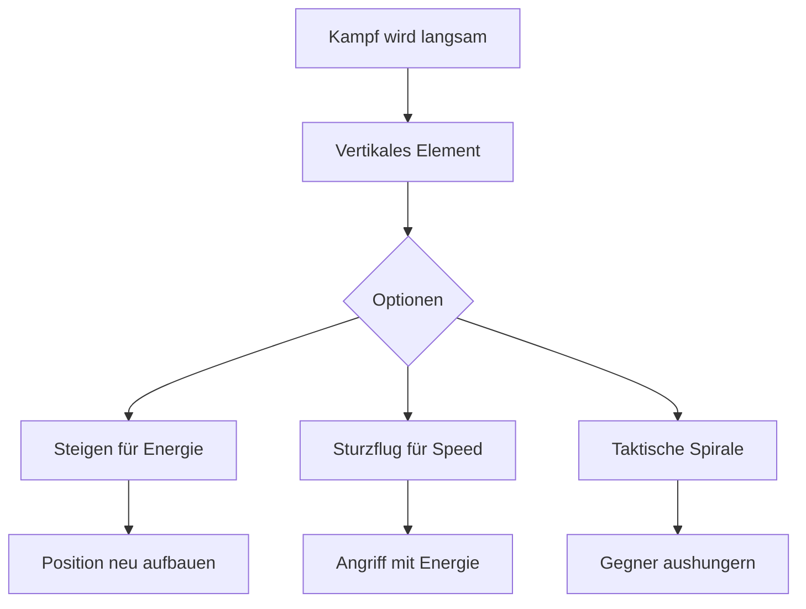
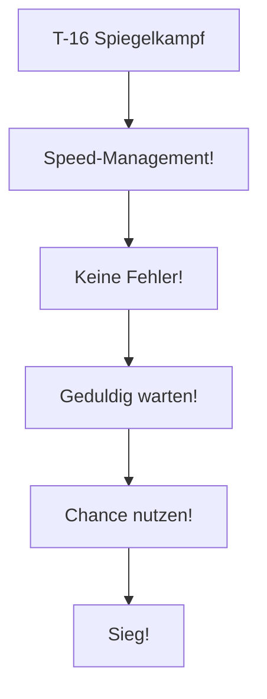

# T-16 vs T-16 Spiegelkampf

> Gleiche Maschinen - Pilot-Skill entscheidet

## Die Herausforderung

| Parameter | Deine T-16 | Gegner T-16 |
|-----------|-----------|-------------|
| Turn Rate | Identisch | Identisch |
| Schub | Identisch | Identisch |
| Radius | Identisch | Identisch |
| **Unterschied** | **Pilot-Skill** | **Pilot-Skill** |

::: warning HARTER KAMPF
Im Spiegelkampf gibt es keinen technischen Vorteil. Nur **Fehler des Gegners** oder **besseres Flying** entscheiden!
:::

---

## Die Strategie

### Das Kern-Prinzip

> **Keine Fehler machen. Auf Gegner-Fehler warten. Speed-Management perfektionieren!**

---

## Entscheidende Faktoren

### 1. Speed-Management

Der Pilot mit der **besseren Corner Speed** gewinnt minimale Vorteile pro Turn:

### 2. Energy-State Awareness

Wer hat mehr Energie?

| Situation | Bedeutung | Aktion |
|-----------|-----------|--------|
| Du höher + schneller | Energie-Vorteil | Aggressiv kämpfen |
| Gleiche Energie | Neutral | Auf Fehler warten |
| Er höher + schneller | Nachteil | Defensive, Fehler provozieren |

### 3. Geometrie-Entscheidungen

---

## Taktiken für den Vorteil

### Lead Turn nutzen

Wenn du den Merge besser timst:

**Risiko:** Zu früh = du zeigst ihm dein Heck!

### Scissors provozieren

Wenn der Gegner overshoots:

1. **Erkennen:** Er fliegt an dir vorbei
2. **Reversal:** Schnell die Richtung wechseln
3. **Scissors:** Wechselnde Richtungswechsel
4. **Patience:** Wer zuerst überzieht, verliert

### Vertikale Elemente einbauen

Auch im T-16 kannst du vertikal arbeiten:

---

## Häufige Fehler

### Fehler 1: Überzogene Turns

::: danger NICHT ÜBERZIEHEN
Wenn du den Stick zu weit ziehst:
- Speed fällt rapide
- Turn Rate sinkt
- Gegner gewinnt Winkel
:::

**Lösung:** Stick-Druck dosieren. Bleib bei Corner Speed!

### Fehler 2: Ungeduld

::: warning GEDULD IST ALLES
Im Spiegelkampf:
- Keine schnellen Kills
- 5-10 Turns können nötig sein
- Ein Fehler = Niederlage
:::

**Lösung:** Warte auf SEINEN Fehler!

### Fehler 3: Vorhersagbare Manöver

::: tip UNVORHERSEHBAR SEIN
- Variiere deine Turns
- Wechsle zwischen One/Two-Circle
- Nutze vertikale Elemente überraschend
:::

---

## Die Entscheidungsmatrix

### Wann aggressiv sein

| Situation | Aktion |
|-----------|--------|
| Du hast Energie-Vorteil | Pressen! |
| Gegner macht Fehler | Sofort ausnutzen! |
| Du hast Winkel-Vorteil | Lead Pursuit |

### Wann defensiv sein

| Situation | Aktion |
|-----------|--------|
| Du hast Energie-Nachteil | Separation, neu aufbauen |
| Du bist zu langsam | Extend, Speed aufbauen |
| Unklare Situation | Warten, beobachten |

---

## Zusammenfassung

### DO's (Machen!)

- Corner Speed halten (380-420 kts)
- Auf Gegner-Fehler warten
- Eigene Fehler minimieren
- Geduldig bleiben

### DON'TS (Vermeiden!)

- Überziehen (Stick zu weit)
- Ungeduldig werden
- Vorhersagbar sein
- Speed verlieren

::: info MERKE
Im Spiegelkampf gewinnt nicht das bessere Flugzeug - sondern der bessere Pilot. Sei geduldig, mach keine Fehler, und nutze seine Fehler aus!
:::
