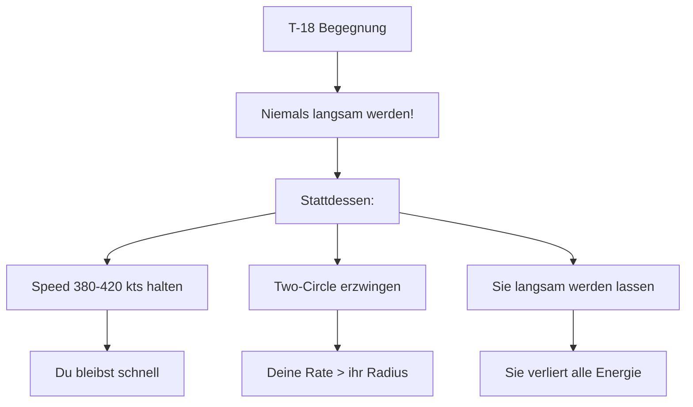
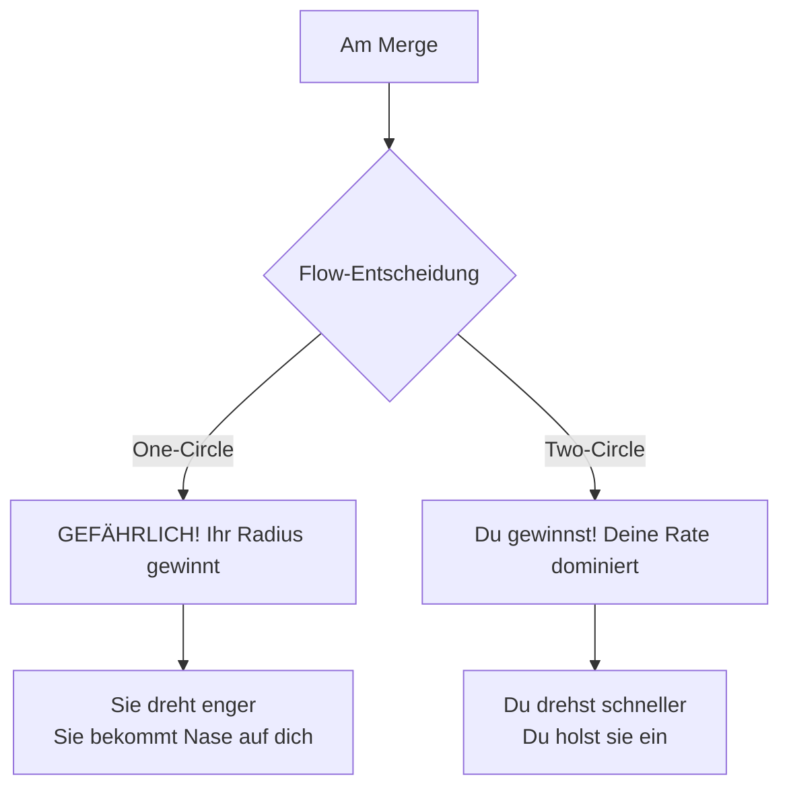
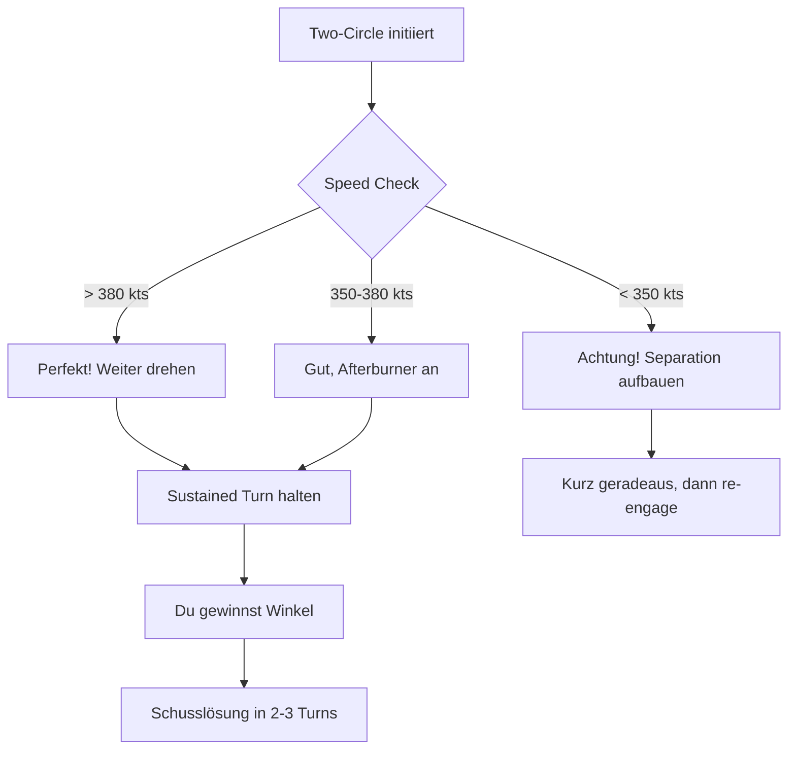
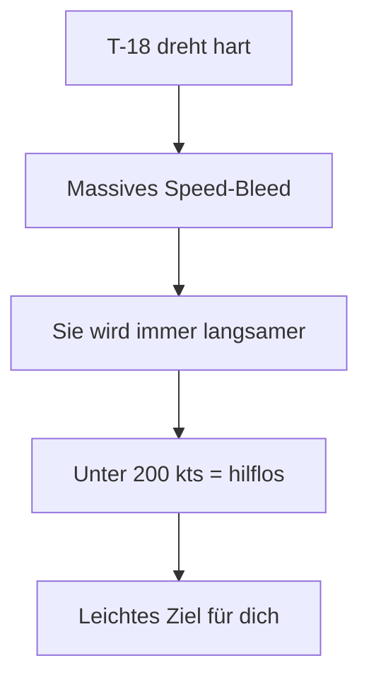
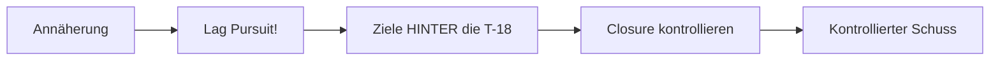
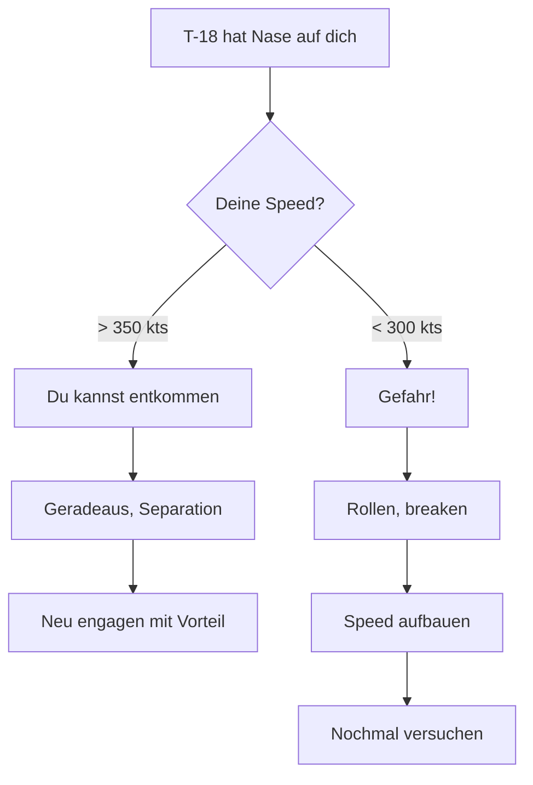
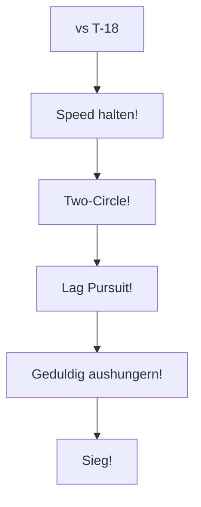

# T-16 vs T-18 Cutlass

> Rate vs Radius - Den Radius-Kämpfer überholen

## Gegner-Profil

| Eigenschaft | T-18 Cutlass |
|-------------|--------------|
| **Typ** | Angles/Radius Fighter |
| **Stärke** | Kleinster Turn Radius, beste Nose Authority |
| **Schwäche** | Langsam, schlechter Schub, massives Energie-Bleed |
| **Corner Speed** | ~250-275 kts |
| **Gefährlichkeit** | Extrem hoch im One-Circle! |

::: tip GUTE NACHRICHT
Die T-18 ist dein **idealer Gegner** - solange du schnell bleibst!
:::

---

## Die Strategie

### Das Kern-Prinzip

> **Speed halten. Two-Circle erzwingen. Sie aushungern!**

---

## Phase 1: Der Merge

### Was die T-18 will

- One-Circle-Fight (Nase auf Nase)
- Dich in ihren "Slow Bubble" ziehen (< 300 kts)
- Ihre überlegene Nose Authority nutzen
- Schneller Snapshot

### Deine Antwort

**Am Merge:**
1. Erkenne die T-18 früh
2. Halte Speed über 380 kts!
3. Two-Circle initiieren (drehe ZUM Gegner)
4. **Nicht verlangsamen!**

---

## Phase 2: Der Two-Circle-Fight

### Warum Two-Circle funktioniert

Die Mathematik:

| Parameter | T-16 (bei 400 kts) | T-18 (bei 250 kts) |
|-----------|-------------------|-------------------|
| Turn Rate | **Hoch** | Mittel |
| Turn Radius | Mittel | Klein |
| Winkelgeschwindigkeit | **Höher!** | Niedriger |
| Energie nach 2 Turns | ~380 kts | ~200 kts |

Im Two-Circle zählt **Rate**, nicht Radius. Du umkreist sie schneller als sie dich!

### Die Ausführung

---

## Phase 3: Die T-18 aushungern

### Das Energie-Problem der T-18

Die T-18 verblutet Energie mit jedem Turn:

### Deine Taktik

1. **Halte den Two-Circle aufrecht**
2. Sie muss drehen um dich zu tracken
3. Jeder Turn kostet sie Speed
4. Nach 2-3 Turns ist sie bei 200 kts
5. Du hast noch 380 kts → **Du dominierst!**

---

## Phase 4: Schusslösung

### Das Problem: Overshoot

Die T-18 ist **extrem langsam** (200-250 kts). Du kommst mit 400 kts.

::: warning OVERSHOOT-GEFAHR
Bei Lead Pursuit fliegst du **garantiert** an ihr vorbei!
:::

### Die Lösung: Lag Pursuit

**Schritt für Schritt:**
1. Bleibe in **Lag Pursuit** (hinter sie zielen)
2. Reduziere Closure Rate mit Throttle
3. Wechsle zu **Lead** nur für den Schuss
4. Sofort zurück zu Lag nach Schuss

---

## Notfall: T-18 hat Nase auf dich

Wenn die T-18 die Nase auf dich bekommt:

::: danger SOFORTMASSNAHMEN
1. **Nicht paniken** - du hast Speed!
2. **Weiterfliegen** - nicht verlangsamen
3. **Roll** - Schusslinie brechen
4. **Extend** wenn nötig, dann re-engage
:::

### Warum du überleben kannst

---

## Speed-Management

### Die Speed-Zonen für T-16

| Speed | Status | Aktion |
|-------|--------|--------|
| 400+ kts | Optimal | Two-Circle dominieren |
| 350-400 kts | Gut | Weiter kämpfen, Afterburner |
| 300-350 kts | Warnung | Separation aufbauen |
| < 300 kts | Gefahr | Du spielst IHR Spiel! |

### Die goldene Regel

> **Sie bei 200 kts ist ein Opfer. Du bei 200 kts bist das Opfer.**

---

## Zusammenfassung

### DO's (Machen!)

- Speed 380-420 kts halten
- Two-Circle erzwingen
- Lag Pursuit bei Annäherung
- Geduldig sein (sie hungert aus)

### DON'TS (Vermeiden!)

- One-Circle (gefährlich!)
- Langsam werden (< 300 kts)
- Lead Pursuit (= Overshoot)
- Ungeduldig in ihre Stärke spielen

::: info MERKE
Die T-18 ist ein One-Trick-Pony. Bleib schnell und sie hat keine Chance!
:::
