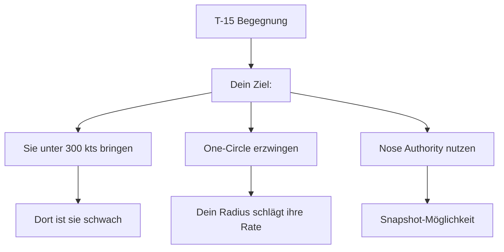
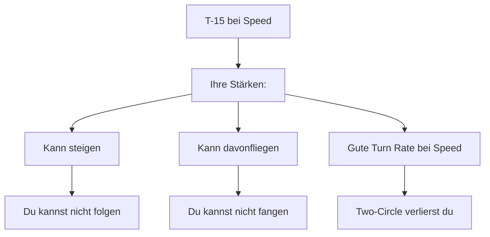
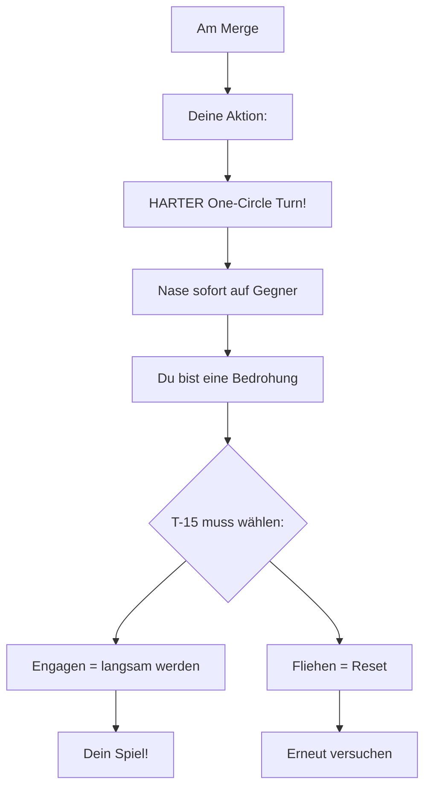
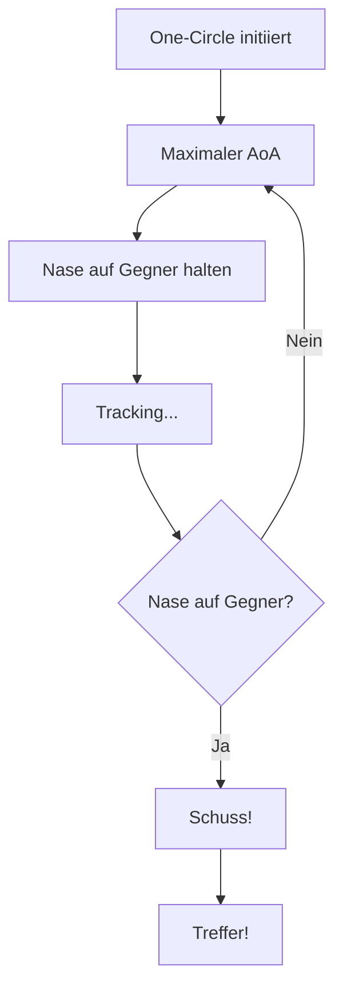
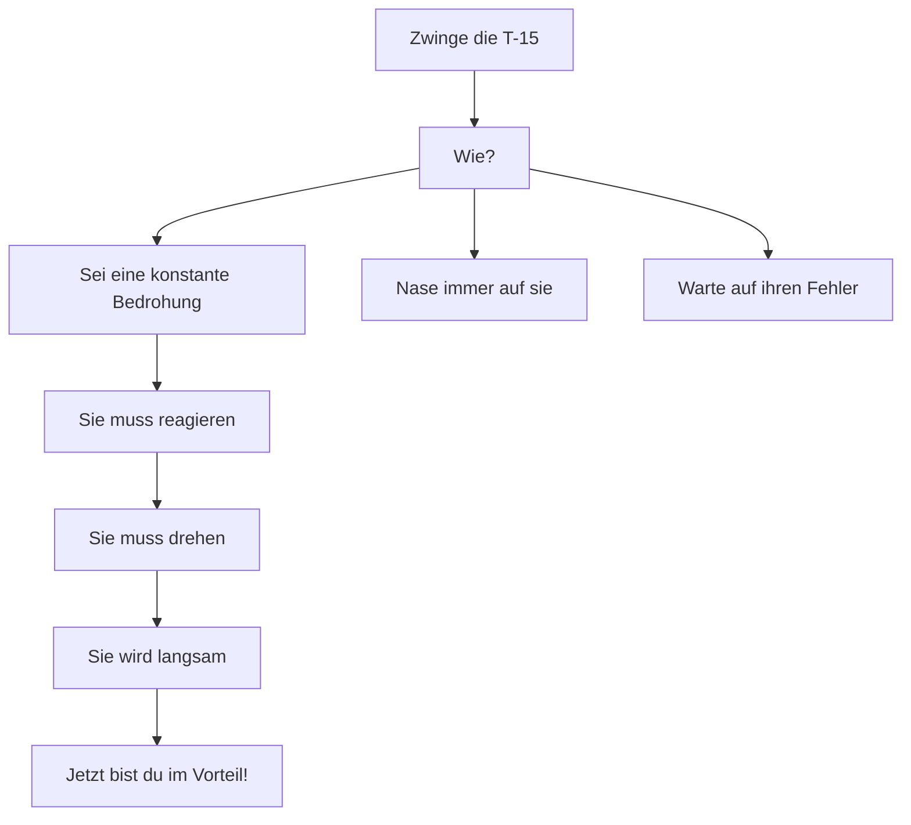
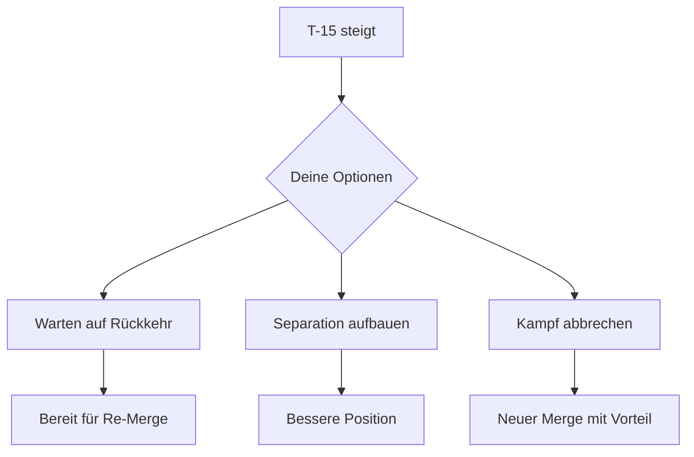
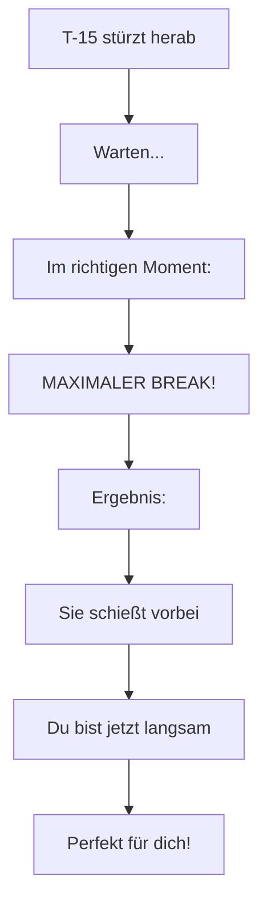
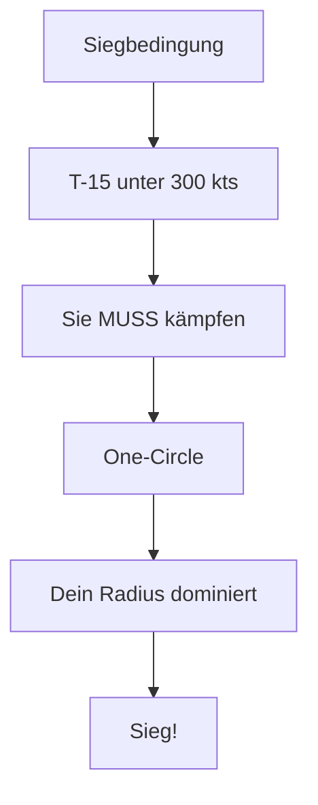
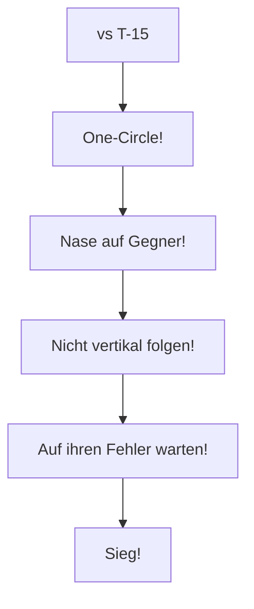

# T-18 vs T-15 Excalibur

> Radius vs Energy - Den Energiekämpfer in dein Revier locken

## Gegner-Profil

| Eigenschaft | T-15 Excalibur |
|-------------|----------------|
| **Typ** | Energy Fighter |
| **Stärke** | Beste Beschleunigung, vertikale Dominanz, Top Speed |
| **Schwäche** | Großer Turn Radius, träge unter 300 kts |
| **Corner Speed** | 400-450 kts |
| **Gefährlichkeit** | Extrem hoch bei Speed + Vertikal! |

::: warning DIE WAHRHEIT
Die T-15 ist technisch überlegen. Du gewinnst nur, wenn du sie in DEIN Spiel zwingst!
:::

---

## Die Strategie

### Das Kern-Prinzip

> **One-Circle erzwingen. Sie langsam machen. Nose Authority nutzen!**

---

## Das Problem: Ihre Stärken

### Warum die T-15 normalerweise gewinnt

### Die Lösung: Ihr Spiel verweigern

::: tip DEINE CHANCE
Eine T-15 unter 300 kts ist:
- Träge
- Kann nicht steigen
- Hat schlechte Rate
- **Wird zu deinem Opfer!**
:::

---

## Phase 1: Der Merge

### Was die T-15 will

- Two-Circle-Fight bei hoher Speed
- Vertikalen Kampf
- Dich langsam machen und dann Boom & Zoom
- Speed-Vorteil behalten

### Deine Antwort

**Am Merge:**
1. **Maximaler AoA Turn** - zieh voll!
2. Nase sofort auf die T-15 richten
3. Bereit für Snapshot
4. Zwinge sie zur Entscheidung

---

## Phase 2: Der One-Circle-Fight

### Warum One-Circle funktioniert

Die Mathematik:

| Parameter | T-18 (bei 250 kts) | T-15 (bei 250 kts) |
|-----------|-------------------|-------------------|
| Turn Radius | **Kleinster!** | Groß |
| Nose Authority | **Beste!** | Schlecht |
| Handling | Gut | Träge |

Im One-Circle bei niedriger Speed dominierst du völlig!

### Die Ausführung

---

## Phase 3: Die T-15 langsam machen

### Das Geheimnis

Die T-15 MUSS langsam werden, um mit dir zu kämpfen. Dein Job ist es, sie zu zwingen:

### Der Gedulds-Kampf

1. **Bleib in One-Circle**
2. Halte Nase auf Gegner
3. Sie muss entweder:
   - Fliehen (Reset - versuche erneut)
   - Kämpfen (wird langsam - DU gewinnst)

---

## Notfall: T-15 steigt weg

Wenn die T-15 in die Vertikale geht:

::: danger KRITISCHE ENTSCHEIDUNG
Du kannst ihr NICHT folgen! Ihr Schub ist zu stark!
:::

### Deine Optionen

**Was tun:**
1. **Nicht folgen!**
2. Horizontal bleiben oder leicht steigen
3. Speed bei 250-300 kts halten
4. Bereit sein für ihren nächsten Angriff
5. Erneut One-Circle erzwingen

---

## Defensiv: Boom & Zoom abwehren

Wenn die T-15 von oben angreift:

### Das Timing

**Schritt für Schritt:**
1. Beobachte die angreifende T-15
2. Warte bis sie fast in Schussreichweite ist
3. **Maximaler AoA Break** in ihre Richtung
4. Sie overshoots (zu schnell)
5. Jetzt bist du langsam - **DEIN Revier!**
6. Dreh die Nase auf sie und greif an!

---

## Die Realität

### Ehrliche Einschätzung

::: warning HARTER KAMPF
- Die T-15 ist technisch überlegen
- Ein guter T-15 Pilot kann oft entkommen
- Du brauchst IHREN Fehler
- Geduld ist ALLES
:::

### Deine Siegbedingung

> **Du gewinnst, wenn die T-15 unter 300 kts engagen MUSS.**

---

## Zusammenfassung

### DO's (Machen!)

- One-Circle erzwingen
- Maximaler AoA nutzen
- Nase auf Gegner halten
- Geduldig sein
- Defensive Breaks bei Boom & Zoom

### DON'TS (Vermeiden!)

- Two-Circle (= Niederlage)
- Vertikal folgen (unmöglich)
- Schnell werden wollen (nicht dein Spiel)
- Ungeduldig werden

::: info MERKE
Die T-15 ist das Energie-Monster. Aber unter 300 kts ist sie nur noch ein großes, träges Ziel. Bring sie dorthin!
:::
