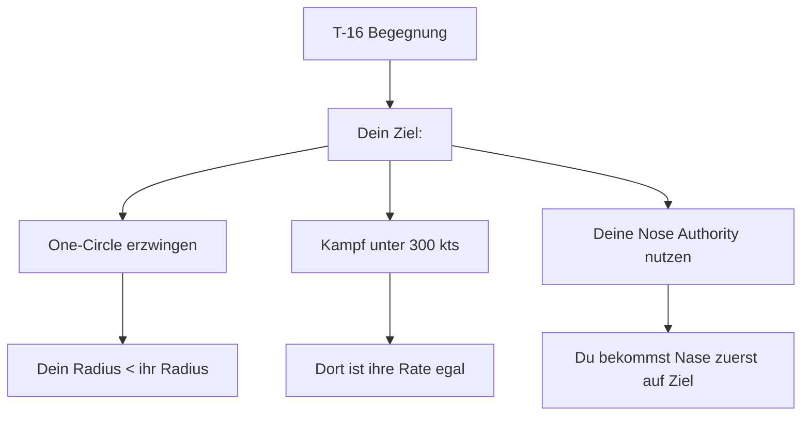
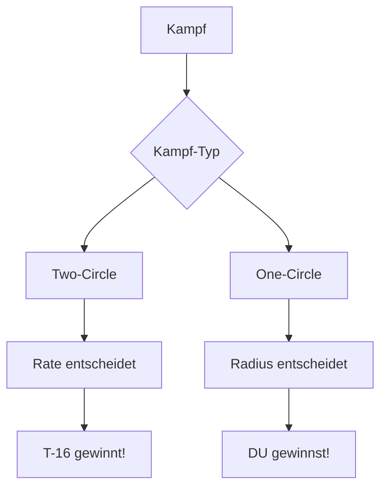
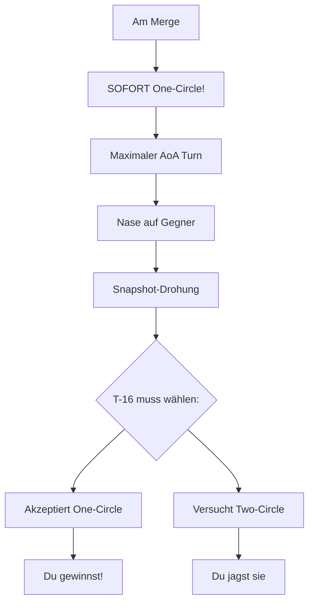
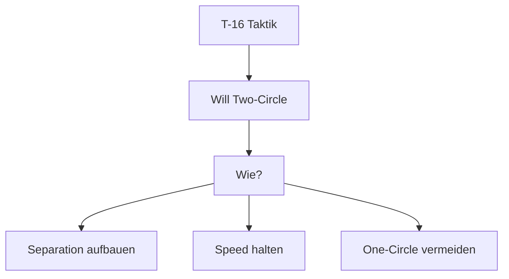
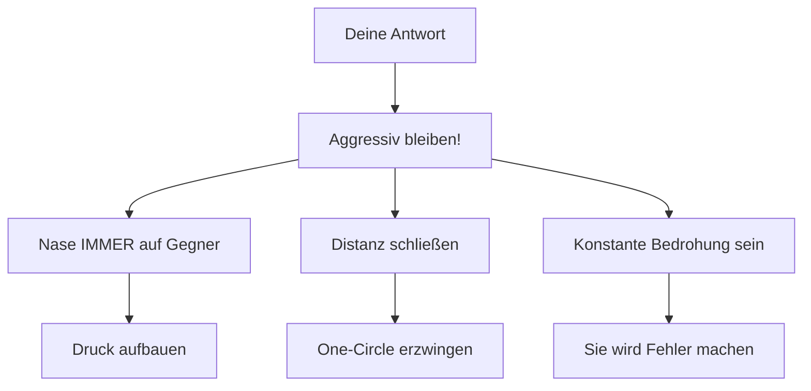
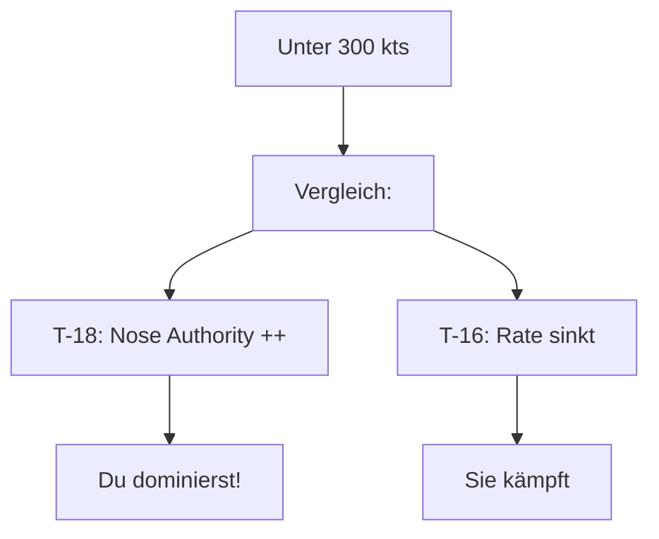
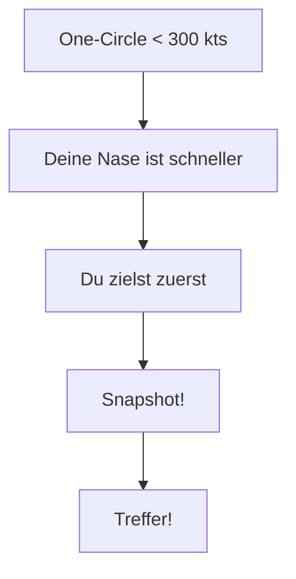
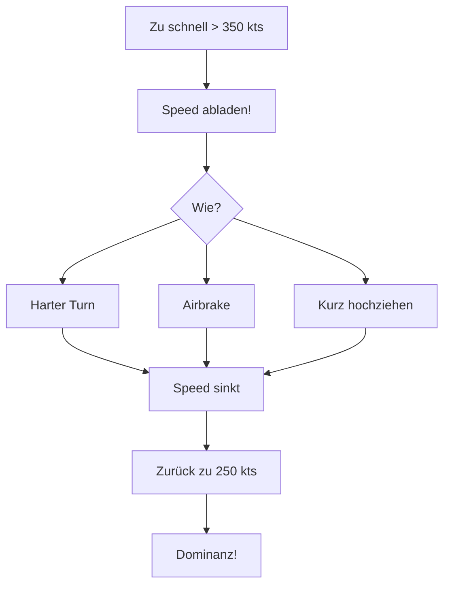
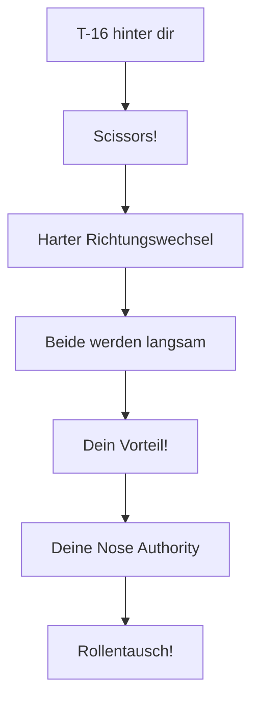
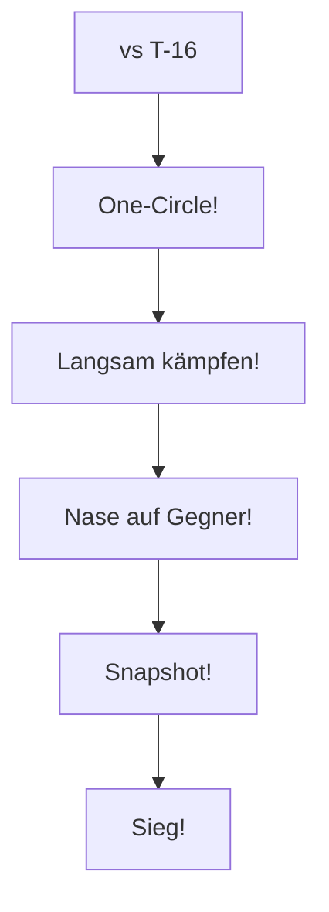

# T-18 vs T-16 Falchion

> Radius vs Rate - Den Rate-Fighter überlisten

## Gegner-Profil

| Eigenschaft | T-16 Falchion |
|-------------|---------------|
| **Typ** | Rate Fighter |
| **Stärke** | Beste Sustained Turn Rate, guter Energieerhalt |
| **Schwäche** | Mittlerer Radius, kein extremes High-AoA |
| **Corner Speed** | 380-420 kts |
| **Gefährlichkeit** | Hoch bei Speed in Two-Circle! |

::: tip DEINE CHANCE
Die T-16 ist dein **machbarster Gegner** - wenn du One-Circle durchsetzt!
:::

---

## Die Strategie

### Das Kern-Prinzip

> **One-Circle erzwingen. Langsam kämpfen. Nose Authority nutzen!**

---

## Der Kampf der Philosophien

### Rate vs Radius erklärt

::: danger KRITISCH
Two-Circle = T-16 gewinnt!
One-Circle = DU gewinnst!
:::

---

## Phase 1: Der Merge

### Was die T-16 will

- Two-Circle-Fight (Nase auf Heck)
- Hohe Speed (380-420 kts)
- Sustained Turn nutzen
- Dich "out-raten"

### Deine Antwort

**Am Merge:**
1. **Maximaler Turn** - Nase sofort auf Gegner
2. Zeige, dass du One-Circle willst
3. Bereit für Snapshot
4. **Nicht aufhören zu drehen!**

---

## Phase 2: Den One-Circle durchsetzen

### Das Problem

Die T-16 wird versuchen, Two-Circle zu erzwingen:

### Deine Antwort

---

## Phase 3: Der Slow-Speed-Fight

### Warum langsam = gut für dich

| Speed | T-18 Performance | T-16 Performance |
|-------|-----------------|------------------|
| 400 kts | OK | **Beste Rate** |
| 300 kts | Gut | Gut |
| 250 kts | **Optimal!** | Schwächer |
| 200 kts | Noch steuerbar | Probleme |

### Die Mathematik

---

## Phase 4: Schusslösung

### Dein Vorteil: Nose Authority

Im One-Circle unter 300 kts:

**Schritt für Schritt:**
1. Bleibe unter 300 kts
2. Maximaler AoA
3. Nase auf Gegner führen
4. **Snapshot** sobald möglich
5. Nicht warten auf perfekte Lösung!

---

## Notfall: Du bist zu schnell

Wenn du über 350 kts bist:

::: warning GEFAHR
Über 350 kts spielt die T-16 DEIN Spiel nicht mehr!
:::

### Lösung: Speed abladen

---

## Defensive Situation

Wenn die T-16 hinter dir ist:

### Scissors einleiten

**Warum Scissors funktioniert:**
1. Beide Flugzeuge verlangsamen
2. Bei niedriger Speed hast du Vorteil
3. Dein Radius ist kleiner
4. Du kannst die Rolle tauschen

---

## Zusammenfassung

### DO's (Machen!)

- One-Circle erzwingen
- Langsam kämpfen (250-300 kts)
- Maximaler AoA nutzen
- Nase auf Gegner halten
- Snapshots nehmen

### DON'TS (Vermeiden!)

- Two-Circle (= Niederlage)
- Schnell werden (> 350 kts)
- Ihr Spiel spielen
- Separation zulassen

::: info MERKE
Die T-16 ist der Rate-König. Aber Rate ist egal, wenn der Kampf langsam ist. Erzwinge DEIN Spiel!
:::
