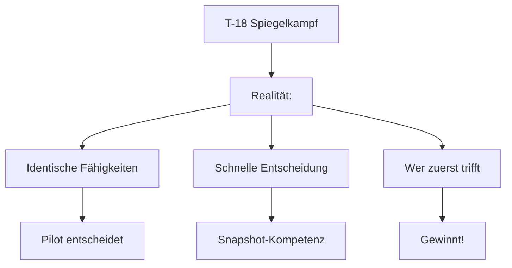
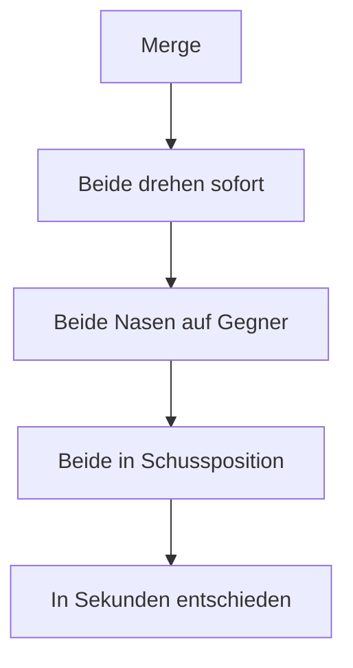
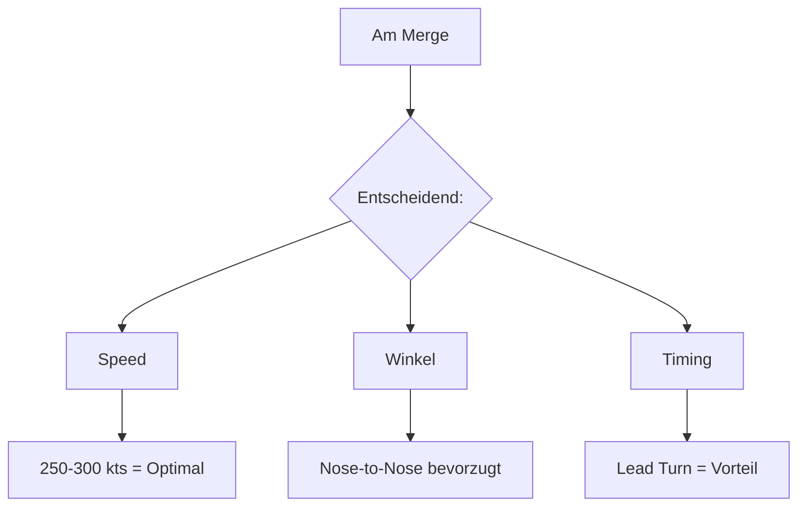
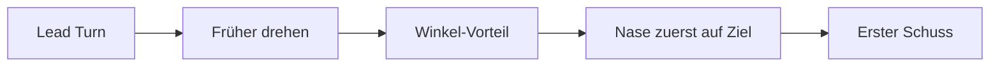
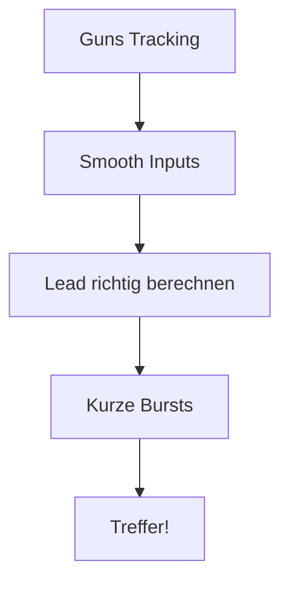
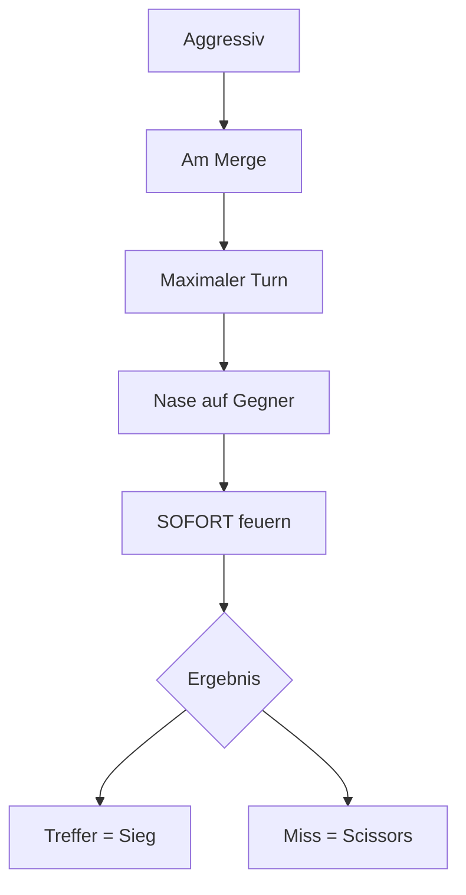
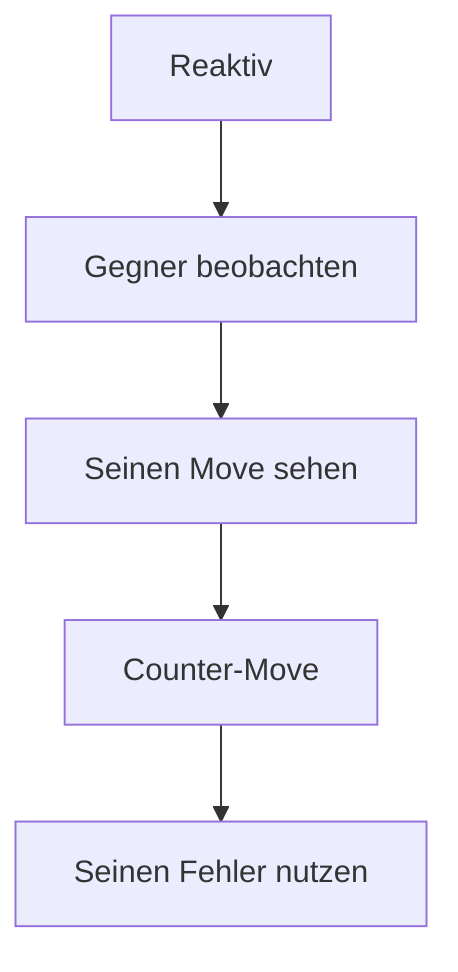
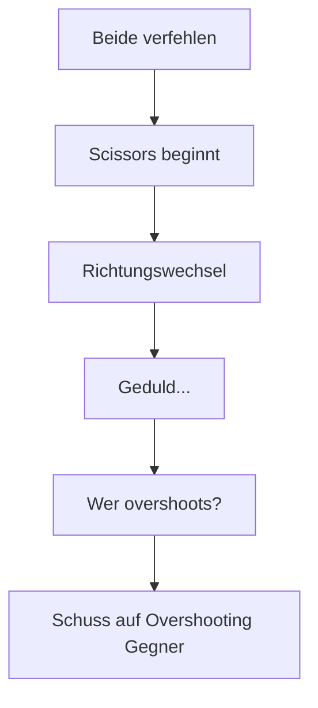
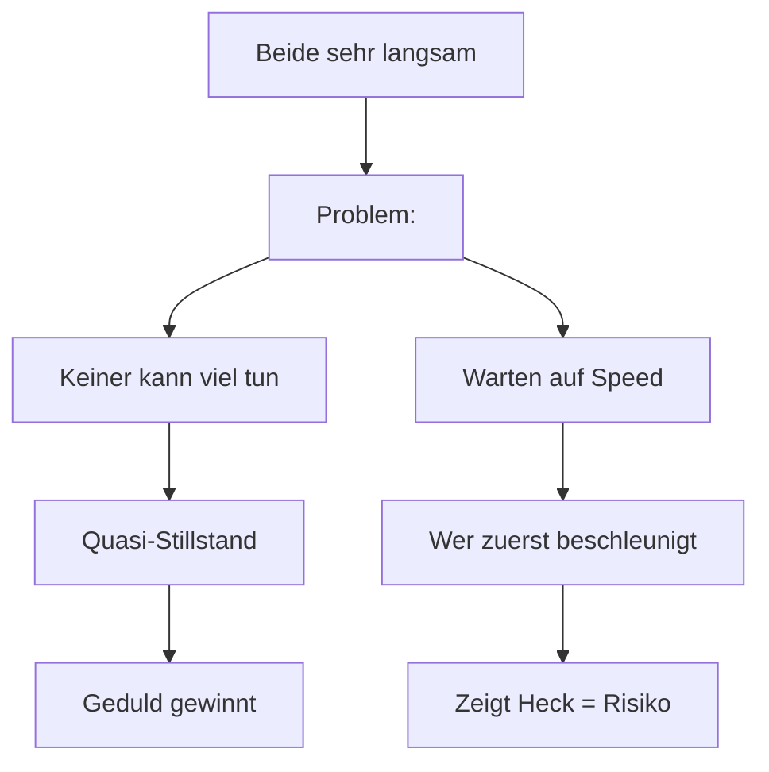
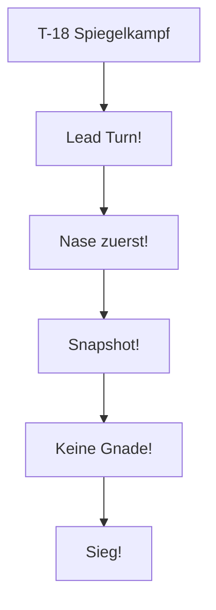

# T-18 vs T-18 Spiegelkampf

> Gleiche Monster - Wer blinzelt zuerst?

## Die Herausforderung

| Parameter | Deine T-18 | Gegner T-18 |
|-----------|-----------|-------------|
| Turn Radius | Identisch | Identisch |
| Nose Authority | Identisch | Identisch |
| High-AoA | Identisch | Identisch |
| **Unterschied** | **Pilot-Skill** | **Pilot-Skill** |

::: warning BRUTALER KAMPF
Zwei T-18 im Nahkampf sind wie zwei Messerstecher in einer Telefonzelle. Schnell und blutig!
:::

---

## Die Strategie

### Das Kern-Prinzip

> **Erster Schuss gewinnt. Nose first. Kein Zögern!**

---

## Die Natur des Kampfes

### Warum es schnell geht

**Typischer Ablauf:**
1. Merge bei ~250-300 kts
2. Beide ziehen maximalen AoA
3. Beide bekommen Nase auf Gegner
4. Wer zuerst trifft, gewinnt
5. Oft in **einem Turn** entschieden!

---

## Entscheidende Faktoren

### 1. Merge-Qualität

Der Merge ist ALLES im T-18 Spiegelkampf:

### 2. Lead Turn

Wer zuerst dreht, hat Vorteil:

**Aber Vorsicht:**
- Zu früh = du zeigst Heck
- Timing muss stimmen!

### 3. Guns Tracking

---

## Taktische Optionen

### Option 1: Aggressiver Ansatz

**Wann nutzen:**
- Du bist confident
- Guter Merge-Winkel
- Gegner zögert

### Option 2: Reaktiver Ansatz

**Wann nutzen:**
- Gegner ist aggressiv
- Schlechter Merge-Winkel
- Unsichere Situation

### Option 3: Scissors

Wenn keiner trifft:

---

## Häufige Fehler

### Fehler 1: Zu früh schießen

::: danger VERSCHWENDETE MUNITION
Wenn du zu früh schießt:
- Keine Treffer
- Munition verschwendet
- Gegner weiß wo du bist
:::

**Lösung:** Warte auf Schusslösung!

### Fehler 2: Zu spät schießen

::: danger VERPASSTE CHANCE
Wenn du zu lange wartest:
- Er schießt zuerst
- Du stirbst
:::

**Lösung:** Snapshot nehmen wenn möglich!

### Fehler 3: Vorhersagbare Moves

::: warning NICHT VORHERSAGBAR SEIN
Im Spiegelkampf:
- Variiere deine Richtungswechsel
- Überrasche mit Timing
- Sei unberechenbar
:::

---

## Speed-Management

### Die Speed-Zone

| Speed | Status | Bedeutung |
|-------|--------|-----------|
| 250-300 kts | Optimal | Beste Nose Authority |
| 200-250 kts | Gut | Noch voll steuerbar |
| 150-200 kts | Gefährlich | Beide fast stehend |
| < 150 kts | Kritisch | Wer zuerst Speed hat |

### Das Langsamkeits-Dilemma

---

## Die Entscheidungsmatrix

### Aggressiv sein wenn:

| Situation | Aktion |
|-----------|--------|
| Du hast Lead Turn | Pressen! |
| Besserer Merge-Winkel | Sofort Nase drauf |
| Gegner zögert | Ausnutzen! |

### Defensiv sein wenn:

| Situation | Aktion |
|-----------|--------|
| Schlechter Merge | Scissors vorbereiten |
| Gegner hat Lead | Counter vorbereiten |
| Unklare Situation | Beobachten |

---

## Zusammenfassung

### DO's (Machen!)

- Lead Turn anstreben
- Snapshot wenn möglich
- Smooth Tracking
- Schnelle Entscheidungen

### DON'TS (Vermeiden!)

- Zu früh schießen
- Zu lange warten
- Vorhersagbar sein
- Zögern am Merge

::: info MERKE
Im T-18 Spiegelkampf gibt es keine zweite Chance. Wer zuerst die Nase auf Ziel hat und trifft, gewinnt. Sei schnell, sei präzise, sei gnadenlos!
:::
